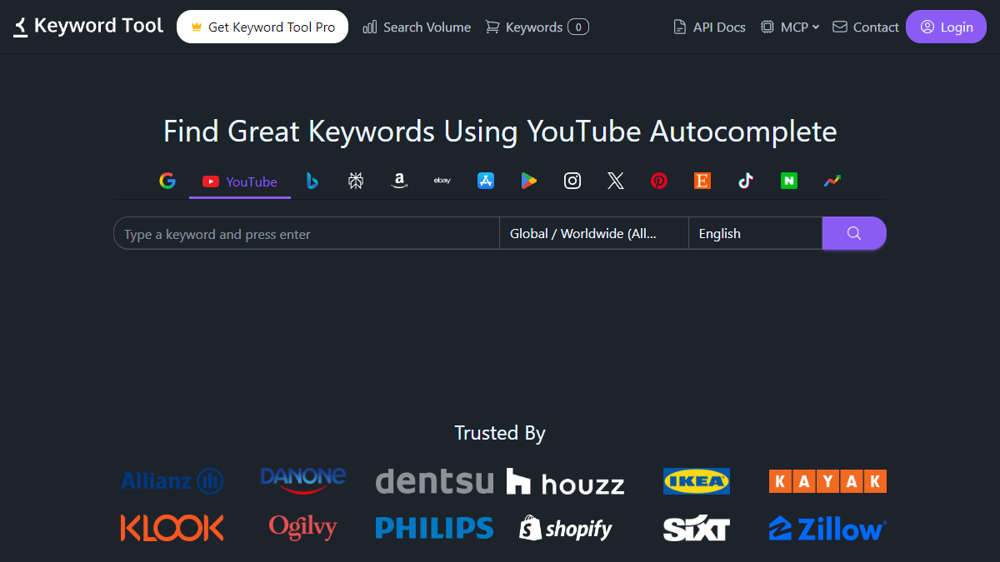
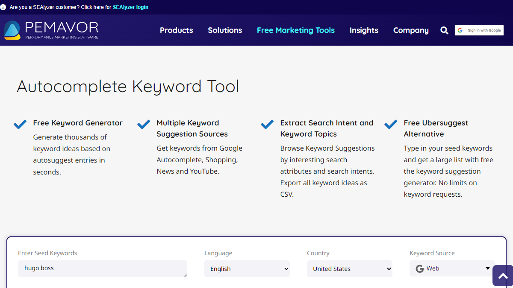
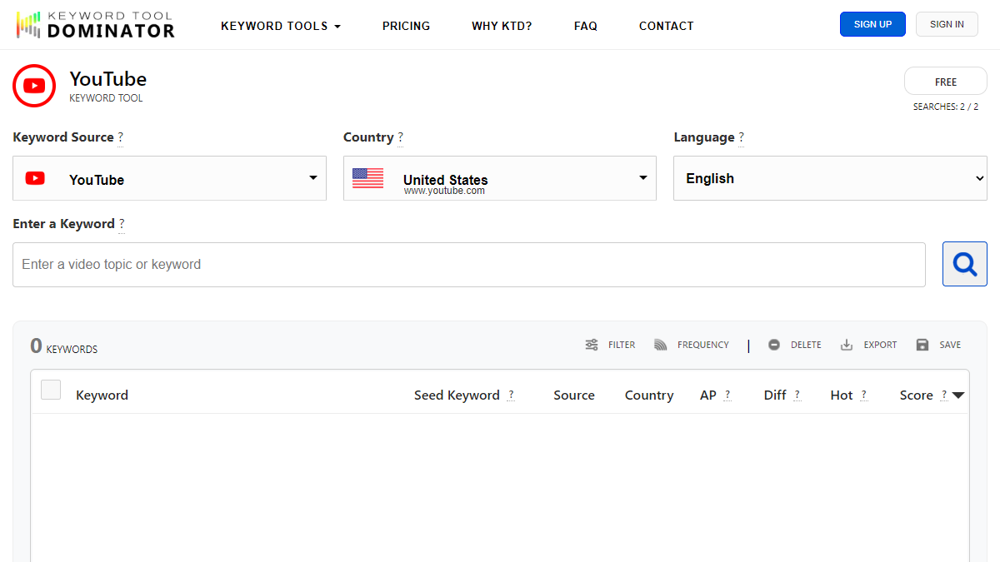
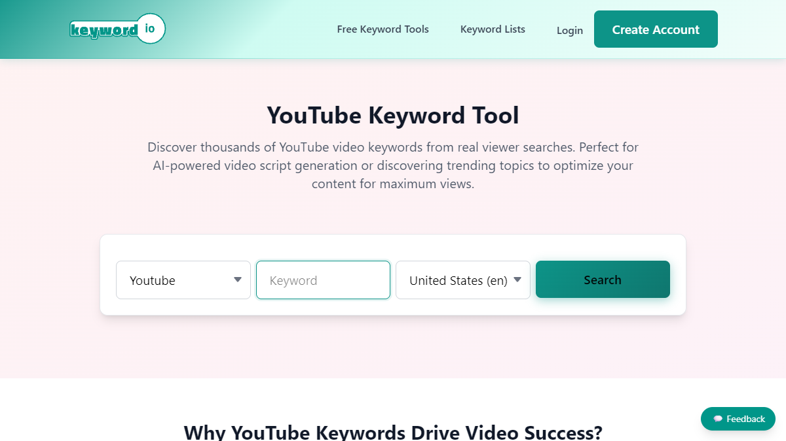
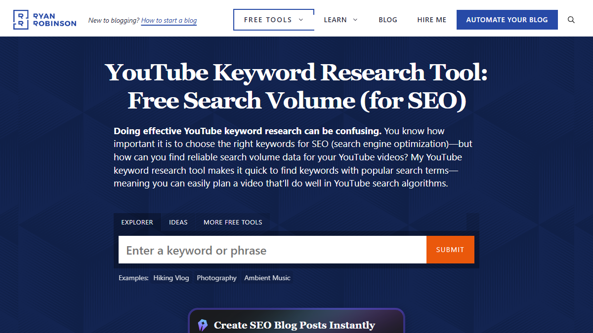
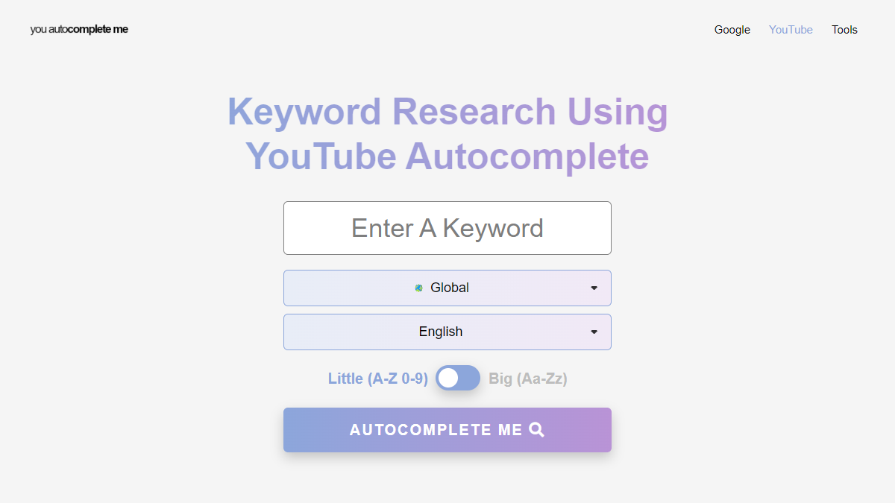
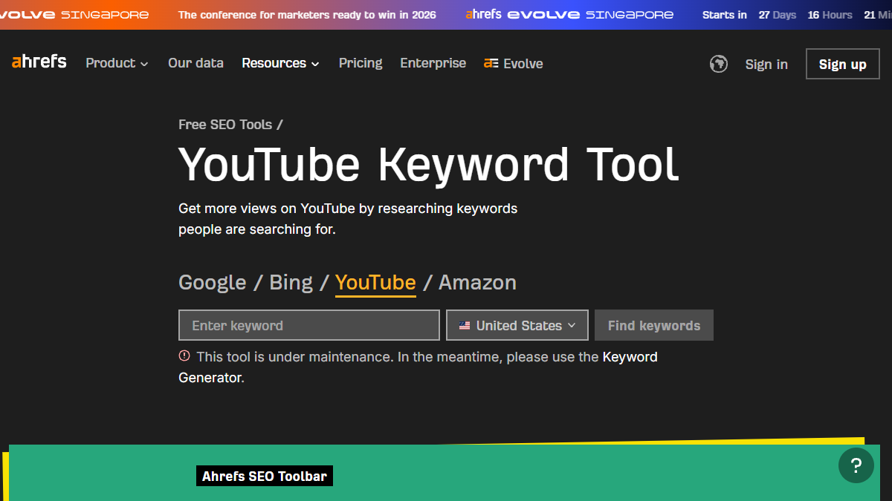
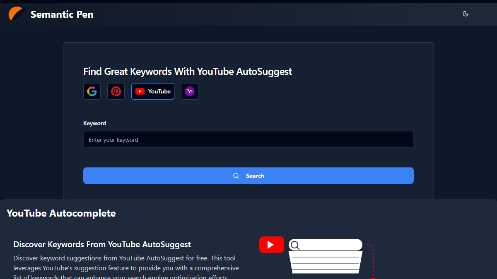
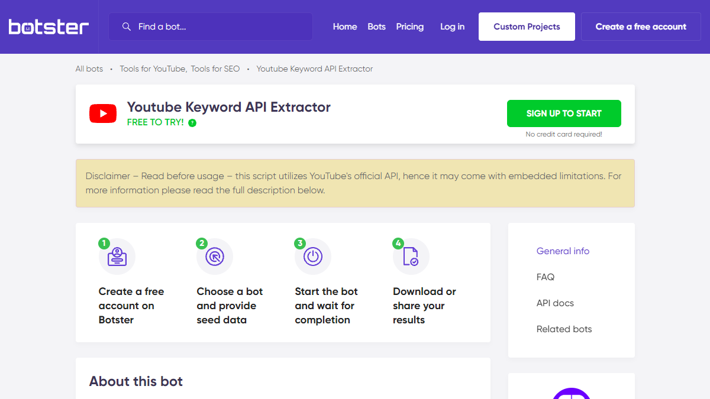
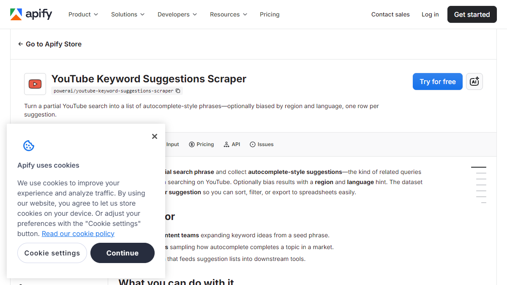

You type "crm for small business" into YouTube's search bar. Eight suggestions appear. You jot them down, then type "crm for small business a," then "b," then "c." Twenty minutes later you have 40 keywords in a messy spreadsheet. No way to tell which ones attract buyers and which attract browsers.

YouTube autocomplete keyword tools fix this. They scrape dozens or hundreds of variations in seconds. The best ones go a step further: they categorize each suggestion by search intent so you know which keywords to prioritize.

This post reviews 10+ tools, evaluated on four criteria that matter for business channels, not creator channels.

Key Takeaways

<ul style="margin: 0; padding-left: 1.25rem;">
<li style="margin-bottom: 0.5rem; color: #334155; font-size: 0.9rem;">YouTube autocomplete reflects real-time search demand. These are the exact phrases people type, not estimated volumes from third-party panels.</li>
<li style="margin-bottom: 0.5rem; color: #334155; font-size: 0.9rem;">The best YouTube autocomplete keyword tools tag suggestions by intent. Knowing the difference between "best CRM for startups" (comparison) and "what is a CRM" (research) determines which video generates leads.</li>
<li style="margin-bottom: 0.5rem; color: #334155; font-size: 0.9rem;">Free tools vary widely. Some return 15 keywords with no export. Others return 200+ with a CSV download. Check before committing to a workflow.</li>
<li style="margin-bottom: 0.5rem; color: #334155; font-size: 0.9rem;">SellonTube's tool is the only one that tags every keyword with buyer-intent priority (High, Medium, Low) and exports a categorized CSV. Free, no signup for quick results.</li>
<li style="margin-bottom: 0.5rem; color: #334155; font-size: 0.9rem;">Developer scrapers (Botster, Apify) generate the most keywords but require technical setup. Best for agencies processing autocomplete data at scale.</li>
<li style="margin-bottom: 0; color: #334155; font-size: 0.9rem;">Pair autocomplete data with a <a href="/tools/youtube-seo-tool">YouTube SEO tool</a> to check whether your existing videos match the phrases buyers actually search.</li>
</ul>

## Contents

- [What to Look For in a YouTube Autocomplete Keyword Tool](#what-to-look-for-in-a-youtube-autocomplete-keyword-tool)
- [Comparison Table: YouTube Autocomplete Keyword Tools](#comparison-table-youtube-autocomplete-keyword-tools)
- [The 10+ Best YouTube Autocomplete Keyword Tools](#the-11-best-youtube-autocomplete-keyword-tools)
  - [SellonTube YouTube Autocomplete Keyword Tool](#1-sellontube-youtube-autocomplete-keyword-tool)
  - [KeywordTool.io](#2-keywordtoolio)
  - [Pemavor Autocomplete Tool](#3-pemavor-autocomplete-tool)
  - [Keyword Tool Dominator](#4-keyword-tool-dominator)
  - [Keyword.io](#5-keywordio)
  - [RyRob YouTube Keyword Tool](#6-ryrob-youtube-keyword-tool)
  - [YouAutoCompleteMe](#7-youautocompleteme)
  - [Ahrefs YouTube Keyword Tool](#8-ahrefs-youtube-keyword-tool)
  - [SemanticPen](#9-semanticpen)
  - [Botster YouTube Keyword Scraper](#10-botster-youtube-keyword-scraper)
  - [Apify YouTube Autocomplete Scrapers](#11-apify-youtube-autocomplete-scrapers)
- [How to Choose the Right YouTube Autocomplete Tool](#how-to-choose-the-right-youtube-autocomplete-tool)
- [What to Do This Week](#what-to-do-this-week)
- [Common Questions](#common-questions)

---

## What to Look For in a YouTube Autocomplete Keyword Tool

**A YouTube autocomplete keyword tool** is a tool that scrapes YouTube's search suggestion API for any seed keyword and returns the long-tail phrases real users type. Unlike volume-based keyword tools that estimate search demand from panel data, autocomplete tools surface the exact queries YouTube recommends to searchers in real time.

The best YouTube autocomplete keyword tools combine three things: broad keyword expansion (A-Z prefixes, suffixes, and intent modifiers like "best," "vs," or "mistakes"), search intent categorization that separates buyer queries from browser queries, and one-click CSV export so results move directly into your content plan. Based on SellonTube's analysis of 500+ autocomplete queries across B2B verticals, the gap between a basic autocomplete scraper and one with intent tagging is the difference between a keyword list you never open again and one that drives your next 10 video titles.

So what does this actually mean for your keyword research? Four things separate a useful tool from a gimmick.

<svg viewBox="0 0 800 160" width="100%" style="max-width: 800px; margin: 1.5rem auto; display: block;" role="img" aria-label="Four-step autocomplete keyword workflow: Enter seed keyword, A-Z plus modifier expansion, intent categorization, export and plan">
  <defs>
    <marker id="arrowG" markerWidth="8" markerHeight="6" refX="8" refY="3" orient="auto">
      <path d="M0,0 L8,3 L0,6" fill="#10b981"/>
    </marker>
  </defs>
  <rect x="0" y="0" width="800" height="160" rx="16" fill="#f8fafc" stroke="#e2e8f0" stroke-width="1.5"/>
  <text x="400" y="24" text-anchor="middle" fill="#94a3b8" font-family="Inter,system-ui,sans-serif" font-size="10" font-weight="700" letter-spacing="0.1em">HOW AUTOCOMPLETE KEYWORD TOOLS WORK</text>
  <rect x="20" y="42" width="160" height="96" rx="12" fill="#ecfdf5" stroke="#10b981" stroke-width="1.5"/>
  <text x="100" y="78" text-anchor="middle" fill="#064e3b" font-family="Inter,system-ui,sans-serif" font-size="24">&#x1F50D;</text>
  <text x="100" y="102" text-anchor="middle" fill="#064e3b" font-family="Inter,system-ui,sans-serif" font-size="12" font-weight="700">1. Seed keyword</text>
  <text x="100" y="118" text-anchor="middle" fill="#065f46" font-family="Inter,system-ui,sans-serif" font-size="10">"crm for small business"</text>
  <line x1="185" y1="90" x2="210" y2="90" stroke="#10b981" stroke-width="2" marker-end="url(#arrowG)"/>
  <rect x="215" y="42" width="160" height="96" rx="12" fill="#ecfdf5" stroke="#10b981" stroke-width="1.5"/>
  <text x="295" y="78" text-anchor="middle" fill="#064e3b" font-family="Inter,system-ui,sans-serif" font-size="24">&#x1F524;</text>
  <text x="295" y="102" text-anchor="middle" fill="#064e3b" font-family="Inter,system-ui,sans-serif" font-size="12" font-weight="700">2. A-Z + modifiers</text>
  <text x="295" y="118" text-anchor="middle" fill="#065f46" font-family="Inter,system-ui,sans-serif" font-size="10">60-100+ API queries</text>
  <line x1="380" y1="90" x2="405" y2="90" stroke="#10b981" stroke-width="2" marker-end="url(#arrowG)"/>
  <rect x="410" y="42" width="170" height="96" rx="12" fill="#ecfdf5" stroke="#10b981" stroke-width="1.5"/>
  <text x="495" y="78" text-anchor="middle" fill="#064e3b" font-family="Inter,system-ui,sans-serif" font-size="24">&#x1F3AF;</text>
  <text x="495" y="102" text-anchor="middle" fill="#064e3b" font-family="Inter,system-ui,sans-serif" font-size="12" font-weight="700">3. Intent tagging</text>
  <text x="495" y="118" text-anchor="middle" fill="#065f46" font-family="Inter,system-ui,sans-serif" font-size="10">High / Medium / Low priority</text>
  <line x1="585" y1="90" x2="610" y2="90" stroke="#10b981" stroke-width="2" marker-end="url(#arrowG)"/>
  <rect x="615" y="42" width="165" height="96" rx="12" fill="#ecfdf5" stroke="#10b981" stroke-width="1.5"/>
  <text x="697" y="78" text-anchor="middle" fill="#064e3b" font-family="Inter,system-ui,sans-serif" font-size="24">&#x1F4CA;</text>
  <text x="697" y="102" text-anchor="middle" fill="#064e3b" font-family="Inter,system-ui,sans-serif" font-size="12" font-weight="700">4. Export + plan</text>
  <text x="697" y="118" text-anchor="middle" fill="#065f46" font-family="Inter,system-ui,sans-serif" font-size="10">CSV with metadata</text>
</svg>

**Instant access.** Some tools require an account, credit card, or API credentials before you see a single keyword. If you cannot paste a keyword and get results in under 10 seconds, the tool adds friction you do not need.

**Suggestion volume.** A tool that returns 10 keywords is a demo. One that returns 100+ gives you a real dataset. Look for tools that expand your seed with A-Z prefixes, suffixes, and intent modifiers.

**Export and copy.** Keywords stuck on a webpage are useless for planning. You need CSV export or a copy-all button at minimum. Check whether the export includes metadata like intent tags, geography, or timestamps.

**Additional data.** Raw autocomplete keywords tell you what people search. Volume estimates, intent tags, or popularity scores tell you which keywords to target first. Not every tool offers this. The ones that do save you a second step.

**The bottleneck is not finding keywords. It is knowing which ones will attract buyers.**

Here's what the manual process looks like next to an autocomplete tool:

**What most channels do:** Open YouTube, type a keyword, write down 8 suggestions. Repeat with 10 variations. Spend 30 minutes collecting 80 keywords in a spreadsheet with no way to prioritize them.

**What actually works:** Enter one seed keyword into an autocomplete tool. Get 100-200+ suggestions tagged by buyer intent in 60 seconds. Export the CSV. Sort by priority. Pick three High-intent keywords. Start filming.

## Comparison Table: YouTube Autocomplete Keyword Tools

| Tool | Free? | Signup? | Keywords/query | Extra data | Export |
|------|-------|---------|----------------|------------|-------|
| **SellonTube** | Yes | No | 30-200+ | Intent tags + priority | CSV |
| KeywordTool.io | Freemium | No | 750+ | Paid only ($89/mo) | CSV (paid) |
| Pemavor | Yes | No | Unlimited | N-gram analysis | CSV |
| Keyword Tool Dominator | Freemium | No | Limited free | Popularity Score | CSV |
| Keyword.io | Yes | No | Hundreds | No | Yes |
| RyRob | Yes | No | Dozens | Volume + competition | Limited |
| YouAutoCompleteMe | Yes | No | 10-15 | No | No |
| Ahrefs | Freemium | No | ~100 free | Volume (limited) | Limited |
| SemanticPen | Freemium | Yes | Standard | No | CSV |
| Botster | Paid | Yes | Thousands | No | Yes |
| Apify | Paid | Yes | Variable | No | API/CSV |

## The 10+ Best YouTube Autocomplete Keyword Tools

### 1. SellonTube YouTube Autocomplete Keyword Tool

**Best for:** Business owners and agencies who need buyer-intent keyword lists from YouTube autocomplete.

SellonTube's [YouTube Autocomplete Keyword Tool](https://sellontube.com/tools/youtube-autocomplete-keywords) scrapes YouTube's suggestion API in two modes. The quick scrape runs A-Z variations of your seed keyword and returns 30-80 keywords in seconds. No signup. No email. No waiting.

The exhaustive scrape goes deeper. It adds 19 buyer-intent modifiers ("best," "vs," "alternatives to," "mistakes," "pricing," "worth it") and fires 60-100+ queries against YouTube. This typically returns 100-200+ unique keywords.

Here's the thing: every keyword gets tagged with one of five intent categories ranked by business value.

<svg viewBox="0 0 700 290" width="100%" style="max-width: 700px; margin: 1rem auto; display: block;" role="img" aria-label="Five intent categories ranked by business value: Comparison and Evaluation (High), Mistakes and Red Flags (High), Results and Proof (High), How-To and Problem-Solving (Medium), Research and Discovery (Low)">
  <rect x="0" y="0" width="700" height="290" rx="14" fill="#f8fafc" stroke="#e2e8f0" stroke-width="1.5"/>
  <text x="350" y="26" text-anchor="middle" fill="#94a3b8" font-family="Inter,system-ui,sans-serif" font-size="10" font-weight="700" letter-spacing="0.1em">INTENT CATEGORIES RANKED BY BUSINESS VALUE</text>
  <rect x="16" y="42" width="668" height="42" rx="8" fill="#ecfdf5" stroke="#10b981" stroke-width="1.5"/>
  <text x="30" y="68" fill="#064e3b" font-family="Inter,system-ui,sans-serif" font-size="13" font-weight="700">Comparison &amp; Evaluation</text>
  <text x="580" y="68" text-anchor="end" fill="#065f46" font-family="Inter,system-ui,sans-serif" font-size="11">best, vs, alternatives, pricing, review</text>
  <rect x="634" y="52" width="42" height="22" rx="6" fill="#dc2626"/>
  <text x="655" y="67" text-anchor="middle" fill="#ffffff" font-family="Inter,system-ui,sans-serif" font-size="10" font-weight="700">HIGH</text>
  <rect x="16" y="90" width="668" height="42" rx="8" fill="#fffbeb" stroke="#f59e0b" stroke-width="1.5"/>
  <text x="30" y="116" fill="#78350f" font-family="Inter,system-ui,sans-serif" font-size="13" font-weight="700">Mistakes &amp; Red Flags</text>
  <text x="580" y="116" text-anchor="end" fill="#92400e" font-family="Inter,system-ui,sans-serif" font-size="11">mistakes, avoid, wrong, scam, worst</text>
  <rect x="634" y="100" width="42" height="22" rx="6" fill="#dc2626"/>
  <text x="655" y="115" text-anchor="middle" fill="#ffffff" font-family="Inter,system-ui,sans-serif" font-size="10" font-weight="700">HIGH</text>
  <rect x="16" y="138" width="668" height="42" rx="8" fill="#faf5ff" stroke="#a855f7" stroke-width="1.5"/>
  <text x="30" y="164" fill="#581c87" font-family="Inter,system-ui,sans-serif" font-size="13" font-weight="700">Results &amp; Proof</text>
  <text x="580" y="164" text-anchor="end" fill="#6b21a8" font-family="Inter,system-ui,sans-serif" font-size="11">results, case study, ROI, before and after</text>
  <rect x="634" y="148" width="42" height="22" rx="6" fill="#dc2626"/>
  <text x="655" y="163" text-anchor="middle" fill="#ffffff" font-family="Inter,system-ui,sans-serif" font-size="10" font-weight="700">HIGH</text>
  <rect x="16" y="186" width="668" height="42" rx="8" fill="#eff6ff" stroke="#3b82f6" stroke-width="1.5"/>
  <text x="30" y="212" fill="#1e3a5f" font-family="Inter,system-ui,sans-serif" font-size="13" font-weight="700">How-To &amp; Problem-Solving</text>
  <text x="580" y="212" text-anchor="end" fill="#1e40af" font-family="Inter,system-ui,sans-serif" font-size="11">how to, tutorial, setup, for beginners</text>
  <rect x="630" y="196" width="50" height="22" rx="6" fill="#2563eb"/>
  <text x="655" y="211" text-anchor="middle" fill="#ffffff" font-family="Inter,system-ui,sans-serif" font-size="10" font-weight="700">MED</text>
  <rect x="16" y="234" width="668" height="42" rx="8" fill="#f8fafc" stroke="#94a3b8" stroke-width="1.5"/>
  <text x="30" y="260" fill="#334155" font-family="Inter,system-ui,sans-serif" font-size="13" font-weight="700">Research &amp; Discovery</text>
  <text x="580" y="260" text-anchor="end" fill="#64748b" font-family="Inter,system-ui,sans-serif" font-size="11">what is, why, should I, can you</text>
  <rect x="632" y="244" width="46" height="22" rx="6" fill="#94a3b8"/>
  <text x="655" y="259" text-anchor="middle" fill="#ffffff" font-family="Inter,system-ui,sans-serif" font-size="10" font-weight="700">LOW</text>
</svg>

The priority tag tells you which keywords attract viewers closest to a purchase decision. Comparison keywords generate pipeline this quarter. Research keywords build authority over time. Both matter. But the order you target them in determines how fast you see results.

The CSV export includes keyword, intent category, priority level, seed keyword, geography, and timestamp. Twenty geography options let you target autocomplete for specific markets. If you sell to US customers, run the scrape with "United States" selected. Global mode mixes results from every market, which dilutes relevance.

A practical workflow: enter "email marketing software" as your seed. The tool returns keywords like "best email marketing software for Shopify" (High: Comparison) and "email marketing software mistakes" (High: Mistakes). Those two keywords become video titles. Run them through the [YouTube Title Generator](/tools/youtube-title-generator) to test variations. The Research keywords ("what is email marketing software") go into your backlog for authority-building content.

**Key advantage:** The only free autocomplete tool that categorizes keywords by buyer intent and assigns a business priority tag.

**Key limitation:** No search volume estimates. You get real-time demand signals from autocomplete presence, not monthly volume numbers. Pair with RyRob or Ahrefs for volume data. Once you have your keyword list, evaluate topic viability with the [YouTube Video Ideas Evaluator](/tools/youtube-video-ideas-evaluator).

**Verdict:** The fastest path from seed keyword to categorized, exportable keyword list with zero friction.

**Try it:** [SellonTube YouTube Autocomplete Keyword Tool](https://sellontube.com/tools/youtube-autocomplete-keywords)

> **Best starting point:** [SellonTube YouTube Autocomplete Keyword Tool](https://sellontube.com/tools/youtube-autocomplete-keywords). Free, no signup, intent-categorized results in under 60 seconds.

### 2. KeywordTool.io

**Best for:** Researchers who need the highest raw keyword volume per query.

KeywordTool.io pulls from YouTube autocomplete and returns up to 750+ keyword suggestions in the free version. It splits results into keywords, questions, prepositions, and hashtags.

But there's a catch. Search volume, CPC, and competition data are blurred behind a paywall. Pro plans start at $89/month. The free version gives you quantity with no way to prioritize.

**Key advantage:** Generates more raw keywords per query than most tools on this list.

**Key limitation:** Volume data locked behind $89/month. The blurred-data upsell is aggressive.

**Verdict:** Strong for raw keyword discovery. Expensive if you need the data that makes those keywords actionable.

**Try it:** [KeywordTool.io YouTube](https://keywordtool.io/youtube)

### 3. Pemavor Autocomplete Tool

**Best for:** SEO professionals who need bulk autocomplete data across YouTube and Google with zero friction.

Pemavor covers four autocomplete sources: Google Search, Google Shopping, Google News, and YouTube. No account required. No limits on keyword requests. CSV export and clipboard copy included. It also offers an N-gram view that spots word frequency patterns across your results.

**Key advantage:** Unlimited free searches with no signup across multiple platforms.

**Key limitation:** No volume, CPC, or intent data. Raw suggestions only.

**Verdict:** The best free bulk autocomplete tool if you already have a separate way to evaluate keywords.

**Try it:** [Pemavor Autocomplete Tool](https://www.pemavor.com/solution/autocomplete-keyword-tool/)

### 4. Keyword Tool Dominator

**Best for:** Creators who want scored autocomplete data without paying for a full SEO suite.

Keyword Tool Dominator adds a proprietary "Popularity Score" (0-100) to each autocomplete suggestion and flags trending keywords as "hot." It supports 50+ countries and languages.

The free version limits you to 2-3 searches per day. Paid plans are annual: $69/year for YouTube only, $99/year for five tools (YouTube, Google, Amazon, eBay, Etsy).

**Key advantage:** The Popularity Score adds a prioritization layer that most free tools lack.

**Key limitation:** Free tier is too limited for serious research. Scoring methodology is not transparent.

**Verdict:** Good annual value at $69-99/year if you need scored autocomplete data regularly.

**Try it:** [Keyword Tool Dominator](https://www.keywordtooldominator.com/youtube-keyword-tool)

### 5. Keyword.io

**Best for:** Marketers building large keyword lists across multiple search sessions.

Keyword.io's YouTube Longtail Finder runs A-Z expansion on your seed keyword and returns hundreds of autocomplete suggestions. The standout feature is its persistent list builder. Pick keywords from one search, run another, add more, and export the entire accumulated list when you are ready.

No signup. Completely free.

**Key advantage:** The list builder lets you compile keywords across multiple sessions before exporting.

**Key limitation:** No volume, CPC, or intent data. Keywords are raw autocomplete output.

**Verdict:** Ideal for free, multi-session keyword accumulation with no account required.

**Try it:** [Keyword.io YouTube Longtail Finder](https://www.keyword.io/tool/youtube-longtail-finder)

### 6. RyRob YouTube Keyword Tool

**Best for:** Solo creators who want YouTube search volume estimates for free.

RyRob returns keyword suggestions with estimated monthly YouTube search volume and a competition level indicator. This is rare for a free tool. No signup, no credit card.

**Key advantage:** Free YouTube search volume data. You can check demand without paying for a full SEO suite.

**Key limitation:** Volume estimates may be less precise than paid tools. Limited filtering options.

**Verdict:** The best free option when volume data matters more than autocomplete breadth.

**Try it:** [RyRob YouTube Keyword Tool](https://www.ryrob.com/youtube-keyword-tool/)

### 7. YouAutoCompleteMe

**Best for:** Quick keyword brainstorming with zero commitment.

YouAutoCompleteMe pulls autocomplete suggestions directly from YouTube's API. No account. No install. Type a keyword, see suggestions.

**Key advantage:** Dead simple. Works instantly with a clean interface.

**Key limitation:** No export or copy functionality. Aggressive rate limiting: 15-20 searches, then a 30-minute timeout. No additional data of any kind.

**Verdict:** Fine for a quick spot check. Too limited for systematic keyword research.

**Try it:** [YouAutoCompleteMe](https://youautocompleteme.io/youtube/)

### 8. Ahrefs YouTube Keyword Tool

**Best for:** SEO professionals already in the Ahrefs ecosystem.

Ahrefs offers a free YouTube keyword generator with search volume estimates across 170+ countries. The full Keywords Explorer adds keyword difficulty scores and content gap analysis.

**Key advantage:** Trusted clickstream-based data from a respected SEO platform.

**Key limitation:** The YouTube keyword tool has been under maintenance since late 2025. Free version is deliberately limited. Paid plans start at $99/month.

**Verdict:** Worth checking if it comes back online. Not usable as of April 2026.

**Try it:** [Ahrefs YouTube Keyword Tool](https://ahrefs.com/youtube-keyword-tool)

### 9. SemanticPen

**Best for:** Content teams already using SemanticPen's AI writing platform.

SemanticPen includes a YouTube autocomplete suggestion tool as part of its content suite. Copy-all and CSV export are supported.

**Key advantage:** Integrated into a broader content workflow with AI writing features.

**Key limitation:** Requires account creation. Runs on a credit system. Not practical as a standalone autocomplete tool.

**Verdict:** Useful if you already pay for SemanticPen. Skip otherwise.

**Try it:** [SemanticPen YouTube Autocomplete](https://www.semanticpen.com/tools/youtube-autocomplete-suggestion)

### 10. Botster YouTube Keyword Scraper

**Best for:** Agencies and technical teams who need deep autocomplete scraping at scale.

Botster runs a configurable bot that scrapes YouTube autocomplete at multiple depth levels. Depth 1 gets direct suggestions. Depth 2 appends whitespace and re-scrapes. Depth 3 goes one layer deeper. Combined with A-Z and 0-9 modifiers, a single run can return thousands of suggestions.

**Key advantage:** Generates more keywords at greater depth than any GUI-based tool on this list.

**Key limitation:** Requires account creation and pay-as-you-go credits ($3 per 3,000 credits). Not instant: you configure a bot, start it, and wait.

**Verdict:** Overkill for solo keyword research. Powerful for agencies processing autocomplete data at scale.

**Try it:** [Botster YouTube Keyword Scraper](https://botster.io/bots/youtube-keyword-suggestions-scraper)

### 11. Apify YouTube Autocomplete Scrapers

**Best for:** Developers building automated keyword pipelines.

Apify hosts two YouTube autocomplete actors (PowerAI and ScraperMind). Both query YouTube's suggestion API and export results as JSON, CSV, or via REST API. They support prefix and suffix modifiers, region targeting, and scheduled recurring runs.

**Key advantage:** Full programmatic access. Repeatable, scheduled scraping for automated workflows.

**Key limitation:** Requires an Apify account, API token, and developer knowledge. Pricing starts at $4.99 per 1,000 results.

**Verdict:** The right choice if autocomplete data needs to flow into an automated pipeline. Not a marketing tool.

**Try it:** [Apify YouTube Autocomplete Scrapers](https://apify.com/powerai/youtube-keyword-suggestions-scraper)

## How to Choose the Right YouTube Autocomplete Tool

Now, you might be thinking: eleven tools is a lot. Which one do I actually need?

It depends on three things: your budget, your technical comfort, and what you plan to do with the keywords. If you are still deciding whether YouTube is the right channel, read the [YouTube marketing ROI guide](/blog/youtube-marketing-roi) first. Here is a decision framework.

✅ **Use SellonTube when:** You want buyer-intent keywords from YouTube autocomplete with zero setup. Free, no signup, intent-tagged CSV export. Best for business owners and agencies running YouTube for customer acquisition.

✅ **Use Pemavor or Keyword.io when:** You already have a way to evaluate keywords and just need the raw autocomplete data in bulk. Both are free with no signup.

✅ **Use RyRob when:** Search volume estimates matter more than autocomplete breadth. The only free tool that shows YouTube-specific volume numbers.

✅ **Use KeywordTool.io when:** You need 750+ keyword variations per query and are willing to pay $89/month for volume data alongside them.

✅ **Use Keyword Tool Dominator when:** You want a middle ground. Scored autocomplete data at $69-99/year is cheaper than most alternatives.

❌ **Skip YouAutoCompleteMe when:** You need to export or save results. It has no export functionality and rate-limits aggressively.

❌ **Skip Ahrefs for autocomplete when:** Their YouTube keyword tool is currently under maintenance (as of April 2026). Check back later.

❌ **Skip Botster and Apify unless:** You have developer resources and need to process autocomplete data at scale through an automated pipeline.

**Every week you run keyword research without an autocomplete tool, a competitor with less expertise is ranking for the exact long-tail queries your buyers type.**

> **Read more:** [Best YouTube SEO Tools for Business Owners](/blog/best-youtube-seo-tools-for-business)

## What to Do This Week

1. Open the [SellonTube YouTube Autocomplete Keyword Tool](https://sellontube.com/tools/youtube-autocomplete-keywords) and enter your most important product keyword.
2. Run the quick scrape. Review the Comparison & Evaluation keywords first. Those are closest to a buying decision.
3. Download the CSV from the exhaustive scrape. Sort by the priority column.
4. Pick three High-priority keywords. Each one becomes a video title. Use the [YouTube Title Generator](/tools/youtube-title-generator) to create click-worthy variations.
5. Run your existing videos through the [YouTube SEO Tool](/tools/youtube-seo-tool) to check if your metadata matches the phrases buyers actually search.
6. Set a calendar reminder to re-run the scrape quarterly. YouTube autocomplete changes as search behavior shifts.

## Common Questions

### What tools should I use to find YouTube autocomplete keywords?

SellonTube's YouTube Autocomplete Keyword Tool is the best free option for business use. It scrapes YouTube's suggestion API, categorizes results by buyer intent (Comparison, Mistakes, Results, How-To, Research), and exports a tagged CSV. For raw bulk data, Pemavor and Keyword.io are free alternatives. For volume estimates alongside autocomplete suggestions, RyRob is the only free tool that provides YouTube-specific search volume numbers.

### Are there free YouTube keyword research tools that actually work?

Yes. Four tools on this list are fully free with no signup: SellonTube (intent-tagged autocomplete scraping), Pemavor (unlimited multi-platform autocomplete), Keyword.io (persistent list builder across sessions), and RyRob (volume estimates included). KeywordTool.io and Keyword Tool Dominator have free tiers with feature limits. The paid tools (Botster, Apify, Ahrefs) start at $3-99/month depending on the platform.

### How accurate are YouTube autocomplete keyword tools compared to volume-based tools?

Autocomplete tools that scrape YouTube's suggestion API directly (SellonTube, Pemavor, YouAutoCompleteMe) return the exact phrases YouTube surfaces to users. They reflect real-time search demand with high accuracy. They do not estimate monthly search volume. Volume-based tools (RyRob, Ahrefs, vidIQ) use clickstream panel data to approximate how many times a keyword is searched per month. Those estimates can be imprecise for niche or B2B queries. The best approach combines both: use autocomplete for discovery, then validate the top candidates with volume data. For a deeper breakdown of keyword strategy, see the [YouTube SEO guide](/blog/youtube-seo-guide).

### Can I do YouTube keyword research with just the search bar, without a tool?

Yes. Open YouTube, type your seed keyword, and write down the suggestions that appear. Then add a space and "a" after your keyword, note those suggestions, try "b," and so on. This works, but it has three problems: it takes 20-30 minutes per keyword, you cannot export the results, and you have no way to separate buyer queries from informational ones. Autocomplete tools automate the same process in seconds and add structure (intent tags, CSV export, geography filters) that manual scraping cannot match.

### How often does YouTube update its autocomplete suggestions?

YouTube refreshes autocomplete suggestions continuously based on trending searches, seasonal patterns, and overall query volume. A keyword that did not appear last month may appear today if enough people start searching for it. This means autocomplete data has a short shelf life. Re-run your seed keywords through an autocomplete tool quarterly, or monthly if you publish weekly. Stale keyword lists lead to videos optimized for phrases nobody searches anymore.

### Do YouTube autocomplete keyword tools work for non-English languages and regional markets?

Some do. SellonTube supports 20 geographies (US, UK, India, Brazil, and more). KeywordTool.io and Keyword Tool Dominator both support 50+ countries and languages. Pemavor defaults to global results. YouAutoCompleteMe and RyRob are English-only. If you sell to a specific country, always set the geography filter before scraping. Global mode mixes autocomplete results from every market, which dilutes relevance for localized campaigns.

### What is the difference between YouTube autocomplete keywords and Google Keyword Planner data?

YouTube autocomplete keywords are the exact phrases YouTube suggests when a user starts typing. They reflect real-time search behavior on YouTube specifically. Google Keyword Planner (GKP) estimates monthly search volume based on Google Search data, not YouTube. GKP volumes are bucketed into wide ranges (100-1K, 1K-10K) and often overstate demand for niche queries. A keyword with 0 volume in GKP can still appear in YouTube autocomplete because people search for it on YouTube, not Google. For YouTube content planning, autocomplete data is the more reliable demand signal. Learn how to turn keyword insights into a full content strategy in [YouTube Marketing Strategy for B2B](/blog/youtube-marketing-strategy).
