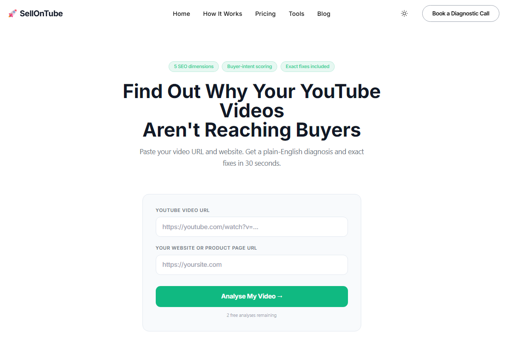
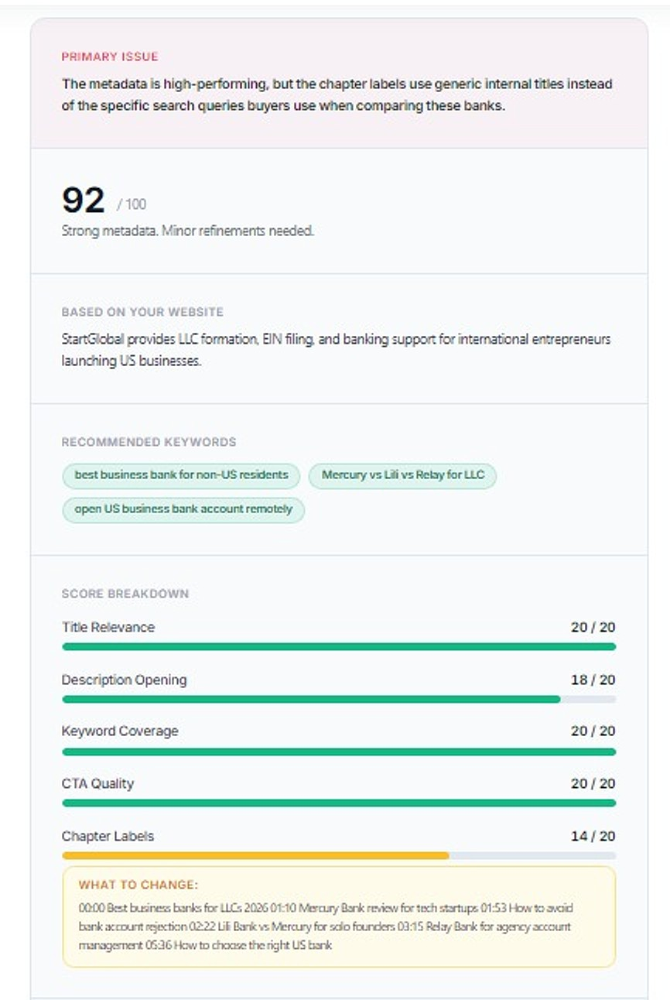
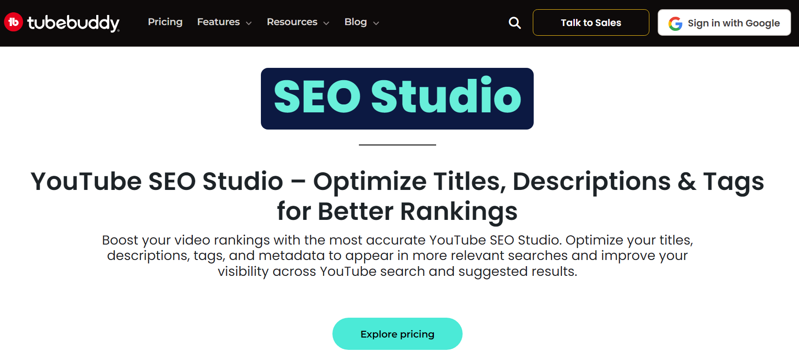
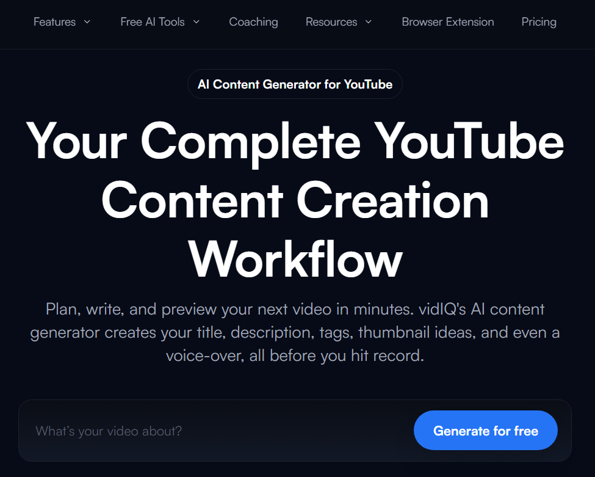
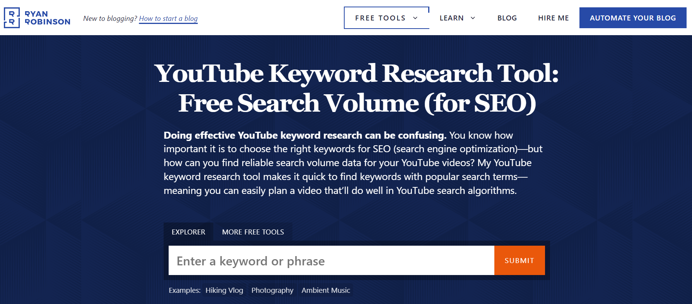
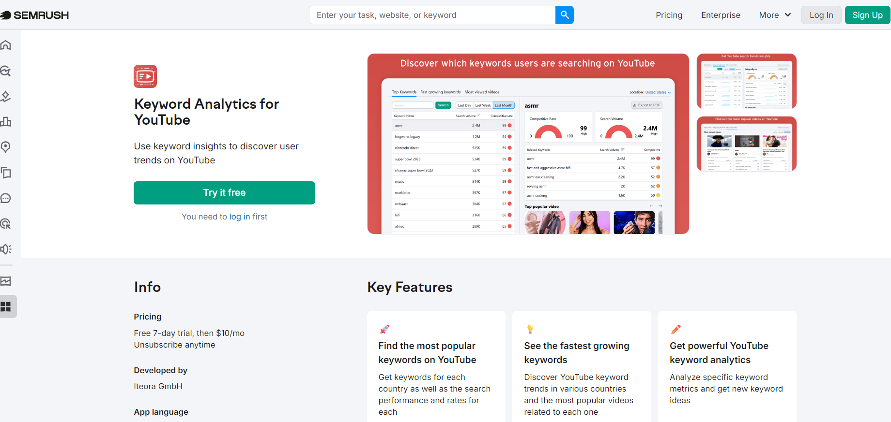
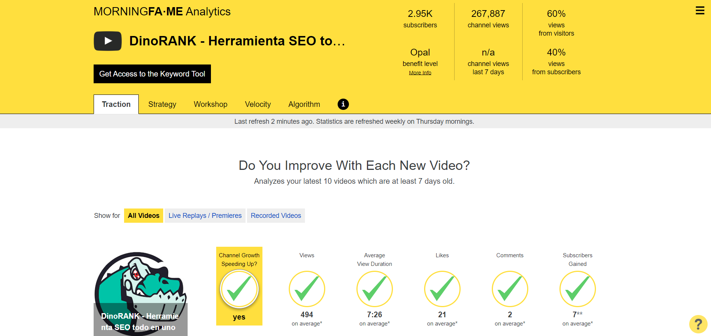

Most YouTube SEO tools were built for the same goal: more views. More subscribers. Higher watch time. Those metrics matter if you publish for an audience. They matter far less if you publish to acquire customers.

YouTube SEO tools were designed with creators in mind. A business channel needs something different. It needs to surface the phrases a potential buyer types when they are close to a decision, not when they are still figuring out whether the problem is worth solving.

That distinction changes which youtube seo tools are actually worth your time. This post covers seven of them, reviewed for SaaS founders, Shopify merchants, agencies, coaches, and consultants who want YouTube to do business work, not just get watched.

A YouTube SEO tool for businesses should do one thing above all else: surface the queries buyers type when they are close to a decision, not the queries viewers type when they are curious about a topic. The two audiences behave differently. The tools that serve them need to work differently too.

Key Takeaways

<ul style="margin: 0; padding-left: 1.25rem;">
<li style="margin-bottom: 0.5rem; color: #334155; font-size: 0.9rem;">YouTube SEO tools built for creators optimise for reach and watch time. Business channels need tools that surface buyer-intent keywords, not trending topics.</li>
<li style="margin-bottom: 0.5rem; color: #334155; font-size: 0.9rem;">A keyword with 500 monthly searches from decision-stage buyers will drive more leads than one with 50,000 searches from casual viewers.</li>
<li style="margin-bottom: 0.5rem; color: #334155; font-size: 0.9rem;">If your videos are getting views without driving enquiries, the issue is almost always the same: titles and descriptions optimised for curiosity, not for the decision-stage query your buyer actually typed.</li>
<li style="margin-bottom: 0.5rem; color: #334155; font-size: 0.9rem;">TubeBuddy and vidIQ are strong for workflow efficiency and competitor tracking, but neither diagnoses whether your video metadata is aligned to commercial intent.</li>
<li style="margin-bottom: 0.5rem; color: #334155; font-size: 0.9rem;">Semrush's YouTube keyword tool is a standalone app at $10/month, worth it if you want cross-platform keyword research without a full Semrush subscription.</li>
<li style="margin-bottom: 0; color: #334155; font-size: 0.9rem;">The fastest path to improvement: run your three most important business videos through a business-specific SEO tool and fix the gaps it surfaces before publishing anything new.</li>
</ul>

## Contents

- [What Makes a YouTube SEO Tool Right for Business](#what-makes-a-youtube-seo-tool-right-for-business)
- [How the Tools Stack Up](#how-the-tools-stack-up)
- [The Best YouTube SEO Tools for Business, Reviewed](#the-best-youtube-seo-tools-for-business-reviewed)
  - [1. SellonTube YouTube SEO Tool](#1-sellontube-youtube-seo-tool)
  - [2. TubeBuddy](#2-tubebuddy)
  - [3. vidIQ](#3-vidiq)
  - [4. RyRob's YouTube Keyword Tool](#4-ryrobes-youtube-keyword-tool)
  - [5. Semrush Keyword Analytics for YouTube](#5-semrush-keyword-analytics-for-youtube)
  - [6. Morningfame](#6-morningfame)
  - [7. Manual YouTube Search](#7-manual-youtube-search-the-baseline-method)
- [What to Do This Week](#what-to-do-this-week)
- [Common Questions](#common-questions)

---

## What Makes a YouTube SEO Tool Right for Business

Most tool comparisons are based on feature count. This one uses a different lens: how well does the tool help a business attract buyers, not just viewers?

Four things matter.

**Buyer-intent keyword discovery.** The right youtube seo tools surface phrases a potential customer types when they are 70 to 80 percent of the way to a decision. Not trending topics. Not high-volume vanity keywords. "Best CRM for solopreneurs" and "how to set up HubSpot" attract different people. One is close to buying. The other is not.

**Competition context.** Volume alone is misleading. A keyword with 2,000 monthly searches and weak competition is more valuable to a new channel than one with 20,000 searches dominated by established players. A useful tool tells you whether a keyword is winnable, not just popular.

**Metadata diagnosis.** A video can rank without reaching buyers. If the title and description are optimised for curiosity-stage queries, you will get views from people who are nowhere near a purchase. A useful tool catches those misalignments and tells you exactly what to fix.

**Conversion alignment.** A viewer who finds your video through a decision-stage keyword is more likely to visit your site, sign up, or book a call. A tool that helps you match your video metadata to a commercial outcome delivers more value than one that optimises for watch time.

These four criteria are the lens this review uses. Not star ratings. Not marketing copy. How well does the tool actually help you get found by the right people?

**The bottleneck is rarely content quality. It is keyword selection and metadata alignment.**

> **Read more:** [The complete guide to YouTube SEO for business channels](/blog/youtube-seo-guide)

## How the Tools Stack Up

| Tool | Best For | Pricing | Buyer-Intent Focus | Free Option |
|---|---|---|---|---|
| [SellonTube YouTube SEO Tool](/tools/youtube-seo-tool) | Diagnosing why videos miss buyers | Free | High | Yes |
| TubeBuddy | Channel management and bulk editing | From $4.99/month | Low | Yes (limited) |
| vidIQ | Trend monitoring and competitor tracking | From $7.50/month | Low | Yes (limited) |
| RyRob's YouTube Keyword Tool | Fast autocomplete-based keyword ideas | Free | Low | Yes |
| Semrush Keyword Analytics for YouTube | YouTube keyword research with volume + trends | $10/month | Medium | No |
| Morningfame | Peer benchmarking and channel analytics | See site | Low | No |
| Manual YouTube Search | Real competition reality check | Free | Medium | Yes |

---

## The Best YouTube SEO Tools for Business, Reviewed

### 1. [SellonTube YouTube SEO Tool](/tools/youtube-seo-tool)

You paste your YouTube video URL and your website URL. Thirty seconds later, you get a diagnosis. Not a score with no context. A plain-English breakdown of the specific reasons your video is not showing up for the people you are trying to reach.

**Pricing:** Free. No login required.

**Key Advantages**

- The only tool in this list that diagnoses buyer-intent alignment, not just keyword volume
- Checks five SEO dimensions: title keyword alignment, description opening, chapter structure, tag relevance, and buyer-intent scoring relative to your product
- Each dimension returns a specific fix, not a vague suggestion
- Free and requires no account

**Key Limitations**

- Built for SEO diagnosis, not channel management or bulk editing
- If you need A/B thumbnail testing or bulk description updates, TubeBuddy handles that better

**Verdict:** The right starting point for any business channel that has been getting views without getting customers. Free, takes 30 seconds, and gives you a concrete list of what to fix.

This is the part that separates it from tools built for creators. TubeBuddy and vidIQ will tell you whether a keyword has search volume and how competitive it is. They will not tell you whether the keyword your video is targeting actually matches the intent of the buyer you are trying to reach. That gap is where most business channels lose ground.

Three scenarios where this shows up clearly.

A SaaS founder who has published a series of tutorial videos notices they rank well in search but see no trial signups from YouTube. Running those videos through the tool reveals that every title is optimised for how-to queries, not for queries from people evaluating tools. The fix is a metadata rewrite, not new content.

An agency managing a client's YouTube channel runs a quarterly audit. Instead of manually reviewing each video's SEO one by one, they run the top 20 videos through the tool and get a prioritised list of fixes in under an hour.

A coach who sells a group programme notices that demo videos have decent views but no enquiries. The tool identifies that the video descriptions front-load a topic summary instead of a problem statement. Buyers who find the video via search cannot tell within the first few seconds that the video is relevant to them.

  <iframe src="https://www.youtube.com/embed/-uE4WxFX5XY" style="position: absolute; top: 0; left: 0; width: 100%; height: 100%;" frameborder="0" allowfullscreen loading="lazy" title="How to use the SellonTube YouTube SEO Tool"></iframe>

> **Read more:** [YouTube marketing for B2B: how to turn your channel into a lead source](/blog/youtube-marketing-b2b)

### 2. [TubeBuddy](https://www.tubebuddy.com/tools/seo-studio/)

TubeBuddy is an all-in-one YouTube channel management toolkit. It sits inside YouTube Studio as a browser extension, giving you keyword data, A/B testing for thumbnails and titles, bulk processing tools, and an SEO scorecard for each upload.

**Pricing:** Free tier available. Paid plans from $4.99/month.

**Key Advantages**

- A/B thumbnail testing (a feature no other tool in this list offers)
- The bulk editing suite saves real time when managing a large channel
- Keyword explorer covers search volume and estimated competition

**Key Limitations**

- Optimises for YouTube performance metrics, not commercial outcomes
- Will not tell you whether a keyword reflects buyer intent or casual curiosity

**Verdict:** The right choice if you already know your target keywords and need workflow efficiency. Not the right starting point if you are still figuring out which queries your buyers actually use.

Here's the thing: the keyword explorer is solid for identifying search volume and estimated competition. But volume is not the same as intent. A keyword with strong stats can still attract the wrong audience entirely.

### 3. [vidIQ](https://vidiq.com/generate/)

vidIQ's headline feature is its daily ideas feed: a stream of trending keywords and suggested video topics based on your channel's history. It also provides competitor tracking and a keyword score that combines search volume, competition, and watch-time potential.

**Pricing:** Free tier available. Paid plans from $7.50/month.

**Key Advantages**

- Competitor analysis is genuinely useful: seeing which videos in your niche are gaining traction, and which keywords they rank for, shortens research time
- Daily ideas feed keeps content planning moving without a blank page

**Key Limitations**

- Ideas engine surfaces topics that are currently gaining views, not topics buyers search when evaluating options
- Trend-first approach is built for audiences, not buyers

**Verdict:** Worth using for competitive research. Not worth relying on for keyword strategy if your channel is meant to attract decision-stage buyers rather than general viewers.

Shopify store owners, agency founders, and SaaS operators are rarely served by chasing what is trending. The keyword ideas that come back from vidIQ often reflect the creator content world rather than the B2B buying journey.

### 4. [RyRob's YouTube Keyword Tool](https://www.ryrob.com/youtube-keyword-tool/)

A clean, simple tool. You enter a seed keyword and it returns a list of long-tail variations based on YouTube autocomplete. No login. No upsells. The phrasing it surfaces often differs from what keyword databases predict, because it pulls directly from what real users type into YouTube search.

**Pricing:** Free.

**Key Advantages**

- Zero friction: no account, no setup, immediate results
- Surfaces real autocomplete phrasing, which is often more accurate than database-derived suggestions
- Good for generating a long list of keyword variations quickly

**Key Limitations**

- No volume or competition data at all. You get a keyword list and nothing else.
- Works best as a starting point, not a decision tool

**Verdict:** Useful at the start of research for surfacing keyword variations. Pair it with TubeBuddy or Semrush to add volume and competition data before acting on anything it returns.

### 5. [Semrush Keyword Analytics for YouTube](https://www.semrush.com/apps/keyword-analytics-for-youtube/)

The Keyword Analytics for YouTube app is a standalone product within the Semrush ecosystem. You do not need a full Semrush subscription to use it. It gives you monthly search volume, competition level, trend data, and related keyword suggestions specifically for YouTube.

**Pricing:** $10/month as a standalone app.

**Key Advantages**

- Cross-channel view: if you are building content across a blog and a YouTube channel, Semrush shows how the same audience searches across both platforms
- Strong data quality on volume and competition
- Accessible without a full Semrush subscription

**Key Limitations**

- Interface assumes familiarity with SEO concepts like keyword difficulty scores, SERP features, and intent classification
- For business owners without an SEO background, the output can be harder to act on than simpler tools

**Verdict:** At $10/month, a reasonable addition if you are doing active YouTube keyword research and want volume and competition data beyond what free tools provide.

So what does this actually mean for your business? The $10/month entry point makes this more accessible than the full Semrush suite. The data quality is strong. The context required to act on it effectively still requires some SEO literacy.

> **Read more:** [How search intent shapes your YouTube SEO strategy](/blog/search-intent-youtube-seo-power)

### 6. [Morningfame](https://morningfa.me/)

Morningfame is a YouTube analytics and optimisation platform that takes a different approach to performance tracking: instead of measuring you against all of YouTube, it compares you against channels of similar size. For a 500-subscriber business channel, that framing produces more actionable comparisons than being benchmarked against channels with 500,000 subscribers.

**Pricing:** Invite-based access. See [morningfa.me](https://morningfa.me/) for current pricing.

**Key Advantages**

- Peer benchmarking against channels of similar size, a more useful frame than absolute metrics
- Breaks down each video's SEO performance with specific, actionable guidance
- Designed to make analytics accessible without an SEO background

**Key Limitations**

- Growth metrics tracked (views, subscribers, watch time) are creator-focused, not buyer-intent focused
- Does not diagnose whether your metadata is targeting decision-stage queries

**Verdict:** A good fit for business owners who want structured analytics and a benchmarked view of where they stand. Complements a tool focused on buyer-intent diagnosis rather than replacing it.

### 7. Manual YouTube Search: The Baseline Method

This is not a tool. It is the step most people skip, and it is often the most informative one.

Open YouTube. Type your keyword. Look at the first five results. Who made them? A media brand with hundreds of thousands of subscribers? A handful of mid-sized channels in your niche? Someone with 2,000 subscribers whose video is two years old?

That tells you more about real competition than any score.

No tool filters this for you. You see exactly what a buyer encounters when they search that phrase: thumbnail quality, view counts, upload dates, and whether those results address the same intent as your planned video.

Use it as a five-minute sanity check before committing to a keyword. A tool scores competition. Manual search shows you what a buyer actually sees. Those are different things, and the difference matters.

---

> **Why keyword intent matters more than search volume**
>
> A keyword with 500 monthly searches from people actively evaluating a product will drive more business than a keyword with 50,000 searches from people who are just curious. Most YouTube SEO tools surface volume. Few surface intent. That gap is where most business channels fail.

What to Do This Week

**1.** Run your three most important business videos through the [SellonTube YouTube SEO Tool](/tools/youtube-seo-tool). For each one, note the primary issue flagged. Look for a pattern across all three. If the same dimension keeps coming up, that is your channel's biggest SEO gap, not a one-off problem.

**2.** Take the buyer-intent keyword from each video's diagnosis. Open RyRob's tool or TubeBuddy and check whether it has meaningful search volume. If volume is low, look at the related keyword suggestions for variants with similar intent but more searches.

**3.** Rewrite the titles and opening description lines of your two lowest-performing videos using the fixes from step one. Keep changes targeted. The goal is to align the metadata with the buyer query, not to rewrite the video itself.

**4.** In 30 days, check those two videos in YouTube Studio. Look at the impression click-through rate and the search traffic breakdown. If both have moved, the rewrite worked. If not, run the videos through the SellonTube tool again. There may be a second-layer issue the first diagnosis did not surface.

**5.** Once your existing videos are fixed, plan what to make next. Use a [YouTube video ideas generator](/tools/youtube-video-ideas-generator) to get buyer-intent ideas matched to your specific product and target customer, before committing to a new video.

## Common Questions

### 1. What is the best free YouTube SEO tool for small businesses?

The SellonTube YouTube SEO Tool is free and built specifically for business use cases. You paste a video URL and your website URL, and get a plain-English diagnosis of why the video is not reaching buyers. No login required. For keyword research, RyRob's YouTube Keyword Tool is also free and works well as a starting point for surfacing long-tail keyword variations.

### 2. Is TubeBuddy or vidIQ better for B2B channels?

Neither was built specifically for B2B. TubeBuddy is the stronger choice if you need workflow tools: bulk editing, thumbnail A/B testing, and channel management. vidIQ is better if you want competitor tracking and trend monitoring. For B2B channels focused on buyer-intent traffic, neither replaces a tool that diagnoses whether your video metadata is actually targeting decision-stage queries rather than general curiosity searches.

### 3. How do I find buyer-intent keywords for YouTube?

Start with the problem your product or service solves. Then think about the phrases someone types when they are evaluating options, not just learning about a topic. Phrases that include "best," "for [your audience type]," "vs," or "[product category] review" tend to attract decision-stage viewers. Use RyRob's tool to generate variations, then use Semrush or TubeBuddy to check volume and competition. Then use the SellonTube tool to confirm your video metadata is aligned with those phrases before publishing.

### 4. Can these YouTube SEO tools be used together?

Yes, and they work best as a stack rather than in isolation. A practical sequence: use RyRob's tool to generate keyword variations, use TubeBuddy or Semrush to check volume and competition on the best candidates, then use the SellonTube YouTube SEO Tool to diagnose whether your video metadata is actually aligned with the keyword you chose. Morningfame then gives you a benchmarked view of how the video performs over time against similar channels. Each tool covers a different layer. None of them covers all four on its own.

Ready to fix your YouTube SEO?

Get a personalised channel diagnostic

Find out exactly why your videos are not reaching buyers and what to fix first.

<a href="https://cal.com/gautham-8bdvdx/30min" target="_blank" rel="noopener noreferrer" style="display: inline-block; background: #10b981; color: #fff; font-weight: 700; padding: 0.75rem 1.75rem; border-radius: 8px; text-decoration: none; font-size: 0.95rem;">Book a diagnostic call</a>

