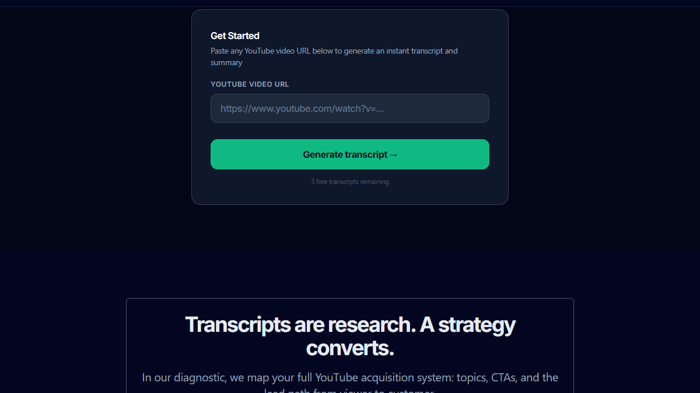
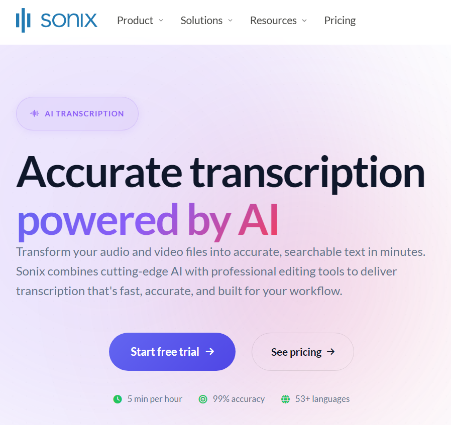
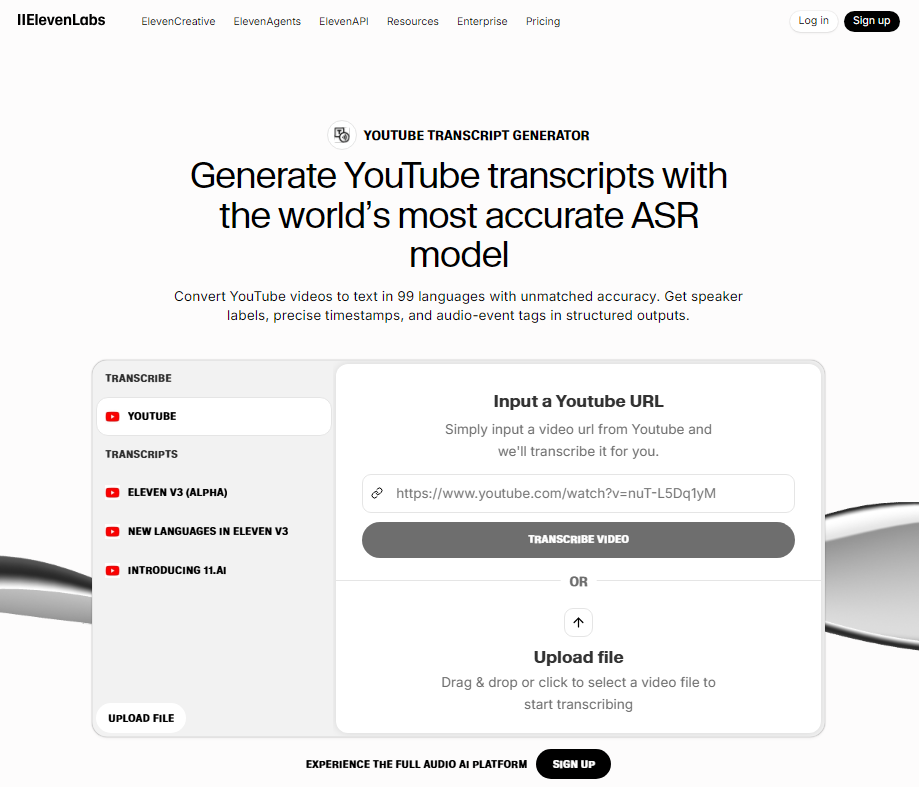
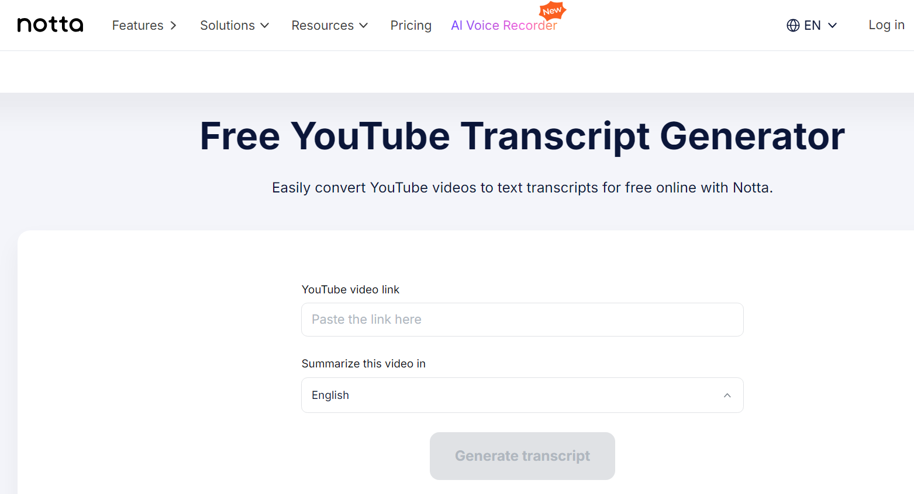
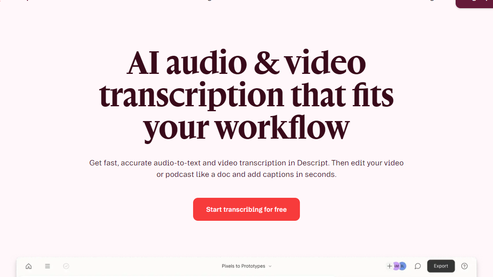
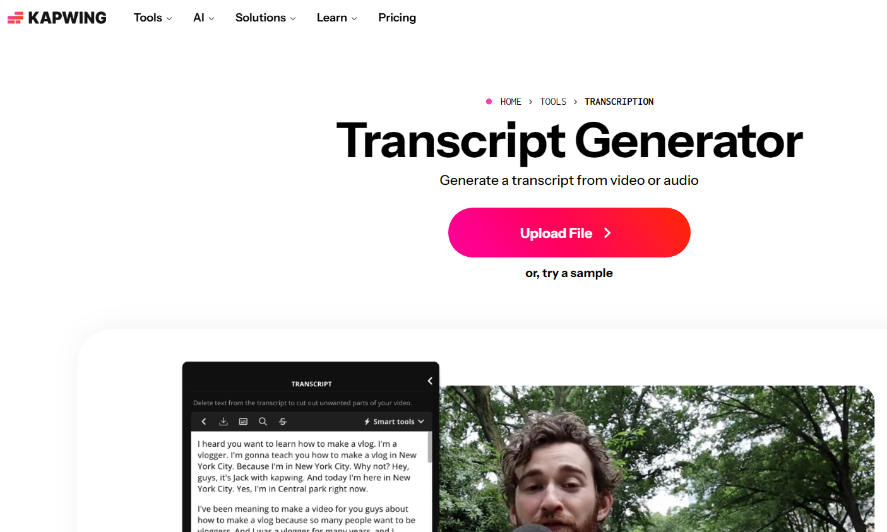
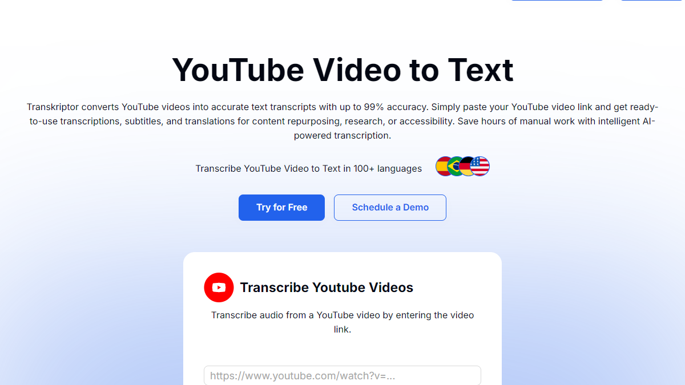
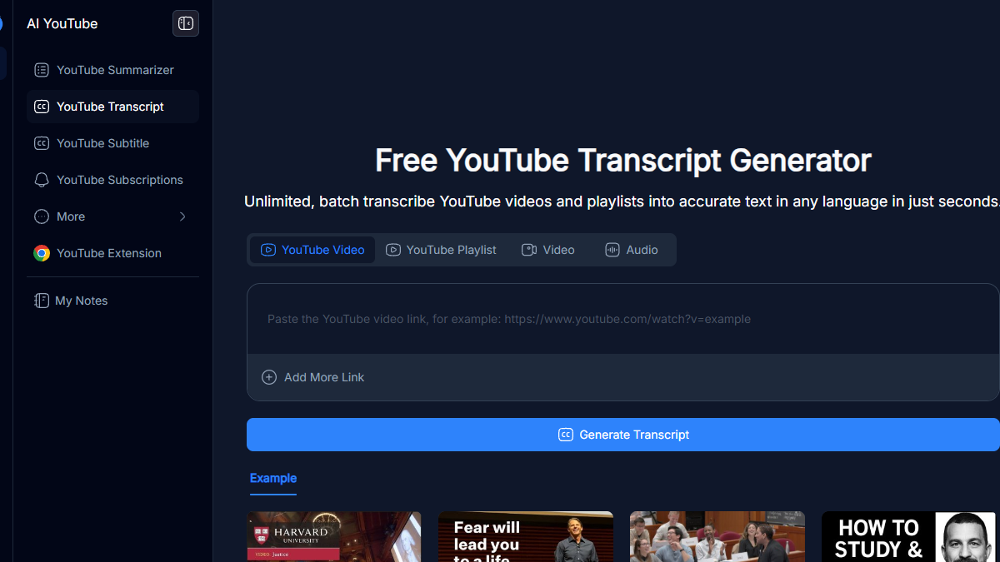
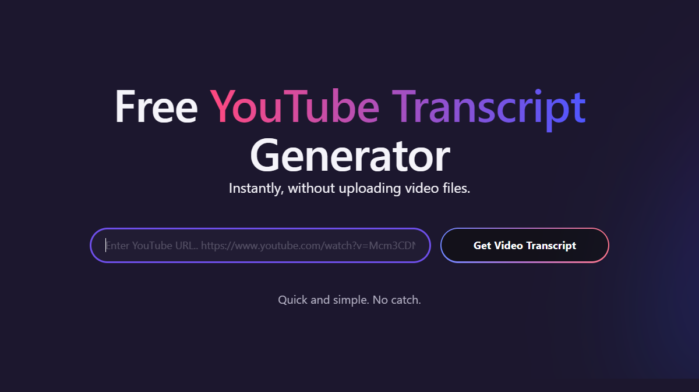

Most YouTube transcript tool lists are written for creators captioning their own videos or journalists transcribing interviews. The tools are ranked on caption accuracy and subtitle export formats.

That framing misses the business use case entirely.

For B2B marketers, SEO managers, GTM teams, and content operators, a transcript generator serves a different job. You need to convert competitor videos into searchable text, extract keyword patterns from high-performing content, repurpose your own video archive into written assets, and feed transcripts into research or AI workflows. Speed, accuracy, and export quality matter. Whether the tool makes good subtitles does not.

This list ranks 14 YouTube transcript generators for that specific job. SellonTube is listed first because it was built around the business use case.

---

## Why transcript tools matter for business teams

A clean transcript turns any YouTube video into a working document. For business teams, that means:

- Extracting competitor positioning and messaging from any public video, without re-watching it
- Pulling SEO keyword patterns from your own or competitors' best-performing content
- Repurposing video content into blog posts, social copy, email sequences, and sales enablement materials
- Building searchable research libraries across dozens of competitor channels over time
- Feeding transcripts into AI tools for pattern analysis, summarisation, gap analysis, and brief generation

The transcript is the raw material. Every workflow above depends on having a clean, accurate version of it.

---

## How we evaluated these tools

Each tool was assessed on:

- **YouTube URL support:** can you paste a public YouTube link and get a transcript directly, without downloading the video first?
- **Accuracy:** how clean is the output on standard English content?
- **Export and usability:** can you get the text into Sheets, Notion, or an AI tool without friction?
- **Business-relevant features:** timestamps, summaries, search, speaker labels
- **Pricing transparency:** clear costs for regular use

---

## At a glance

| Tool | Best for | Free plan? | Pricing |
|------|----------|------------|---------|
| SellonTube | Business and B2B transcript workflows | Yes | Free |
| Sonix | High-accuracy transcripts with rich export | No free tier | ~$10/hr pay-as-you-go or ~$22/mo |
| ElevenLabs | Clean YouTube transcript tool from a reputable AI brand | Yes | Free tier available |
| Notta.ai | YouTube URL transcripts with AI summaries | Yes | Free tier available |
| Descript | Transcript synced to video for deep teardowns | Yes (limited) | Free tier, paid from ~$12/mo |
| Kapwing | Free transcription with repurposing workflow | Yes | Free tier available |
| Transkriptor | Simple, fast, no-frills URL-to-text | No | Usage-based credits |
| NoteGPT | Best zero-friction free option | Yes | Free |
| Tactiq | Browser extension capture while watching | Yes | Free tier |

---

## 1. [SellonTube YouTube Transcript Generator](https://sellontube.com/tools/youtube-transcript-generator)

**SellonTube pros:**

- Built for business use cases: competitor research, SEO, content repurposing, and marketing intelligence
- Returns an AI-powered summary alongside the full transcript, so you get both the raw text and a structured overview in one step
- Free, no signup required, works on any public YouTube URL

**SellonTube cons:**

- Newer tool with less brand recognition than Sonix or Descript
- Best used for single-video research workflows, not bulk transcription at high volume

SellonTube's YouTube Transcript Generator was designed specifically for business use cases. Paste any public YouTube URL and it returns a clean, timestamped transcript alongside an AI-generated summary. The summary is calibrated for business readers: it surfaces the key points, the arguments made, and the structure of the video, not just a generic paragraph recap.

The practical applications for business teams span several workflows. For SEO research, paste competitors' best-ranking videos and scan the transcript for keyword patterns, topic clusters, and phrasing they use that you are not covering. For content repurposing, paste your own videos and get a working document you can turn into a blog post, LinkedIn thread, or email sequence without starting from scratch. For competitive intelligence, build a research file from a competitor's last 10 videos in under an hour: what positioning they lead with, what objections they address, how they frame their product against the market.

Sales and marketing teams use it differently. Account executives paste a prospect's company YouTube content before a call to understand how the company presents itself publicly. Demand gen teams scan competitor video libraries for topic gaps they can own. Content operators use it to repurpose a video backlog that would otherwise sit unused.

It is free, requires no account, and works directly in the browser. For teams doing regular YouTube research, this is the tool to start with. Try it at [sellontube.com/tools/youtube-transcript-generator](https://sellontube.com/tools/youtube-transcript-generator).

**SellonTube price:** Free.

---

## 2. [Sonix](https://sonix.ai/features/automated-transcription)

**Sonix pros:**

- High transcription accuracy with clean timestamps and speaker labeling
- Multiple export formats: TXT, DOCX, SRT, PDF, and more, making it easy to move text into Sheets, Notion, or AI tools

**Sonix cons:**

- No free tier: pay-as-you-go costs add up at volume
- Better suited for systematic research workflows than quick one-off lookups

Sonix is the strongest choice when accuracy and export quality are the priority. Paste a YouTube URL, receive a timestamped transcript, and export in whichever format your downstream workflow needs. The pay-as-you-go rate is around $10 per hour of audio. For teams transcribing regularly, the subscription tier at roughly $22 per month is the better value.

Speaker labeling is a standout feature for competitive research: if a competitor video features multiple presenters or a panel discussion, Sonix separates each speaker clearly, making it easier to attribute specific claims and arguments. The built-in editor lets you review accuracy against the original before exporting.

Teams looking for a free Sonix alternative with business-specific features can start with SellonTube's transcript generator at no cost.

**Sonix price:** ~$10/hr pay-as-you-go, or ~$22/month subscription. Verify current pricing at sonix.ai.

---

## 3. [ElevenLabs YouTube Transcript Generator](https://elevenlabs.io/youtube-transcript-generator)

**ElevenLabs pros:**

- Clean, purpose-built YouTube transcript tool from a well-known and trusted AI brand
- Free tier available, no signup required for basic use

**ElevenLabs cons:**

- Transcription is one feature in a voice-AI platform, not the company's core focus
- Feature depth is lighter than dedicated transcript tools like Sonix or Descript

ElevenLabs is primarily known for voice synthesis and audio AI. Their YouTube Transcript Generator is a clean, standalone tool that works directly from a YouTube URL and returns a readable transcript fast. The brand reputation behind the tool adds credibility: ElevenLabs has a strong technical track record and the transcription output reflects that.

For business teams needing a quick, reliable transcript without signing up for a dedicated transcription platform, this is a solid option. It sits between the zero-friction free tools and the full-featured paid services.

**ElevenLabs price:** Free tier available. Check elevenlabs.io for current plan details.

---

## 4. [Notta.ai](https://www.notta.ai/en/tools/youtube-transcript-generator)

**Notta pros:**

- Dedicated YouTube URL support with AI-generated summaries built in
- Clean export options and a free tier that covers basic use

**Notta cons:**

- Free tier has usage limits
- Less established than Sonix for enterprise workflows

Notta's YouTube transcript tool works by pasting a URL directly. The output includes a timestamped transcript and an AI summary, which is useful for initial triage of competitor content: skim the summary to decide if the full transcript is worth a detailed read. Export formats are clean and straightforward.

For teams that want AI summaries alongside transcripts without paying for a full subscription, Notta's free tier is a practical starting point.

**Notta price:** Free tier available. Paid plans for higher limits. Verify current pricing at notta.ai.

---

## 5. [Descript](https://www.descript.com/transcription)

**Descript pros:**

- Transcript is displayed in sync with the video: click any word to jump to that moment
- Text-based editing lets you treat a video like a document, useful for detailed teardowns

**Descript cons:**

- More than needed if you only want raw text extraction
- Paid plans required for serious use; free tier is limited

Descript makes sense for deep teardowns of competitor demos or product walkthroughs. The synchronized transcript view means you can read a claim in the text and immediately see the context in the video. For research sessions where you are cross-referencing what was said against what was shown, that connection is valuable.

For teams analyzing how competitors demonstrate their product, structure their demos, or handle objections on camera, Descript provides a research environment that no other tool on this list matches. For simpler transcript extraction, it is more tool than you need.

**Descript price:** Free tier available. Paid plans from approximately $12 to $24 per month. Verify at descript.com.

---

## 6. [Kapwing](https://www.kapwing.com/tools/transcription)

**Kapwing pros:**

- Free to use for basic transcription
- Transcript can feed directly into Kapwing's video editing tools: useful for repurposing content in one platform

**Kapwing cons:**

- Primarily a video editing platform; transcription is one feature
- Export options are lighter than dedicated transcription tools

Kapwing is worth considering for teams that want to go from transcript to repurposed content in a single workflow. Extract the transcript from a YouTube video, then use Kapwing's editing tools to clip highlights, add captions, or create short-form versions. The whole process stays inside one platform.

For pure transcript extraction with no editing needed, other tools are more direct. Kapwing earns its place when repurposing content is the actual goal, not just research.

**Kapwing price:** Free tier available. Verify current plan pricing at kapwing.com.

---

## 7. [Transkriptor](https://transkriptor.com/youtube-video-to-text/)

**Transkriptor pros:**

- Fast output with timestamps and 100+ language support
- Straightforward: paste URL, get text, no extras to navigate

**Transkriptor cons:**

- No summaries, search, or library management features
- Pricing is usage-based, which adds up for regular research

Transkriptor does one thing cleanly: convert a YouTube URL into timestamped text. No summaries, no editing environment, no library. If your workflow takes the transcript out of the tool immediately and into Notion, Sheets, or an AI for analysis, that simplicity is a feature. You are not paying for a platform you will not use.

**Transkriptor price:** Usage-based credits. Verify current pricing at transkriptor.com.

---

## 8. [NoteGPT](https://notegpt.io/youtube-transcript-generator)

**NoteGPT pros:**

- Free, no signup, works immediately
- Returns timestamped transcript you can copy directly into Sheets or Docs

**NoteGPT cons:**

- Accuracy depends on audio quality
- No export formats, summaries, or search: copy-paste only

NoteGPT is the right tool for quick spot checks. Paste a YouTube URL, get a timestamped transcript, copy it out. No account needed, no credits to manage. Accuracy varies with audio quality, but for clear English content it is reliable enough for most research purposes.

For occasional use, it is hard to beat free. For systematic research across multiple videos, a tool with proper export and library features saves more time.

**NoteGPT price:** Free.

---

## 9. [Tactiq](https://tactiq.io/tools/youtube-transcript)

**Tactiq pros:**

- Captures transcript directly while you watch, no URL pasting or uploading required
- Free tier covers most basic use cases

**Tactiq cons:**

- One video at a time, in real-time: not suitable for bulk research
- Requires installing a browser extension

Tactiq is the most frictionless option for ad hoc transcript capture. Install the extension, watch a YouTube video, and the transcript appears in the extension panel. No separate tool to open, no URL to paste. For teams that encounter interesting competitor content during normal browsing and want to capture it immediately, Tactiq removes all friction from that workflow.

The real-time, one-video constraint is also the tool's limitation. For systematic research across a list of URLs, a paste-and-go tool is faster.

**Tactiq price:** Free tier available. Optional paid upgrades for higher limits.

---

## Bonus: How to get a YouTube transcript directly from YouTube

YouTube has a built-in transcript feature on most public videos. Here is how to access it:

1. Open any YouTube video in your browser
2. Click the three-dot menu ("...") below the video, next to the like and share buttons
3. Select "Show transcript" from the menu
4. A transcript panel opens on the right side of the screen, with timestamped segments

The transcript is auto-generated by YouTube's speech recognition. For clear English audio it is reasonably accurate. For music, strong accents, technical terminology, or poor audio quality, accuracy drops significantly.

The main limitations for business use: there is no export button, no download, and no formatting. You copy and paste manually, one section at a time. There are no summaries, no search across multiple videos, and no integration with any research workflow. It works for a quick check on a single video. It does not scale.

For accurate transcripts with AI summaries, without the manual copy-paste, [SellonTube's YouTube Transcript Generator](https://sellontube.com/tools/youtube-transcript-generator) handles the same job in seconds and is free to use.

---

## How to choose the right tool

- **For free, business-focused transcripts with AI summaries:** SellonTube
- **For highest accuracy with rich export:** Sonix
- **For deep video teardowns:** Descript
- **For repurposing content in one workflow:** Kapwing
- **For quick free extraction:** NoteGPT or Tactiq
- **For a simple, no-frills URL-to-text tool:** Transkriptor or Notta.ai

---

## FAQ

### What is the best free YouTube transcript generator for business teams?

SellonTube's YouTube Transcript Generator is free, requires no signup, and returns both a clean transcript and an AI summary calibrated for business use. For teams doing competitive research or content repurposing, it is the most practical free starting point.

### What is the best alternative to Sonix for YouTube transcripts?

For free use, SellonTube covers the core transcript and summary workflow at no cost. Sonix is the alternative when high accuracy and rich export options are required. NoteGPT is the simplest free option for occasional use.

### Can these tools transcribe competitor YouTube videos legally?

Yes. These tools work with public YouTube URLs using YouTube's standard access. Generating a transcript of public content for research, analysis, or internal use is standard practice. Check your jurisdiction's rules if you plan to publish the transcript verbatim.

### Do transcript tools help with SEO?

Directly, no. A transcript generator produces text. The SEO value comes from what you do with it: extracting keyword patterns from competitor videos, identifying topic gaps, repurposing video content into written assets that can rank. SellonTube's tool is designed to accelerate that research workflow.
