You posted 40 videos this year. Your analytics show a few hundred views each. Your website traffic from YouTube sits at single digits per week, no enquiries, no leads, no one reaching out to buy. Every idea came from a YouTube video ideas generator built for creators optimising for watch time. Not for businesses optimising for revenue.

The problem is not effort. Most YouTube video idea generators ask for your niche and return topics calibrated for the algorithm. They do not know what your customers search before they buy. They cannot tell the difference between a video that builds purchase intent and one that just performs well in suggested feeds. A business channel needs a fundamentally different kind of idea. (If you haven't set yours up yet, here's [how to create a YouTube channel for your business](/blog/create-youtube-channel-for-business).)

This list covers the 14 best YouTube video ideas generators available in 2026, ranked for business use. SellonTube's tool is listed first because it was built for this specific problem.

---

## Table of contents

**Best for business-focused ideation**

- [SellonTube](#1-sellontube-youtube-video-ideas-generator)
- [vidIQ](#2-vidiq)
- [1of10](#3-1of10)
- [TubeMagic](#4-tubemagic)
- [Embarque](#5-embarque)

**Best free general-purpose generators**

- [RyRob / RightBlogger](#6-ryrob--rightblogger)
- [UTubeKit](#7-utubekit)
- [SpeakNotes](#8-speaknotes)
- [Toolsaday](#9-toolsaday)
- [LenosTube](#10-lenostube)
- [Renderforest](#11-renderforest)

**Best as part of a wider content workflow**

- [VEED.io](#12-veedio)
- [TubeBuddy](#13-tubebuddy-video-topic-planner)
- [Instapage](#14-instapage)

---

## At a glance

| Tool | Best for | Free plan? | Pricing |
|------|----------|------------|---------|
| SellonTube | Business-focused ideation tied to buyer intent | Yes | Free |
| vidIQ | Data-driven ideation on existing channels | Yes | Free to try. Paid plans available |
| 1of10 | Research-led ideation from outlier video data | Yes | Verify before publishing |
| TubeMagic | Competitive research via channel URL analysis | Limited | Freemium. Verify exact plan pricing |
| Embarque | SEO-informed ideas with flexible inputs | Yes | Free. No account required |
| RyRob / RightBlogger | Tone-customised idea generation | Yes | Free with hourly rate limit. Paid plans available |
| UTubeKit | Contextual ideas with strategic reasoning | Yes | Free. No account required |
| SpeakNotes | Fast, zero-friction starting point | Yes | Free |
| Toolsaday | Simple ideation inside a broader writing suite | Yes | Free. Verify before publishing |
| LenosTube | Quick 5-idea generation, no setup | Yes | Free |
| Renderforest | Keyword-based ideas linked to video production | Yes | Free. Verify before publishing |
| VEED.io | Idea to production in one platform | Yes | Free plan. Lite at $24/month |
| TubeBuddy | Keyword-backed content planning and scheduling | Limited | Freemium. Verify current plan pricing |
| Instapage | Free standalone generator from a marketing platform | Yes | Free. Verify before publishing |

---

## What makes the best YouTube video ideas generator for businesses?

Every tool on this list was evaluated against four criteria. First, business relevance: does it generate ideas tied to what buyers actually search before making a purchase decision, or does it just chase trending topics and watch time? Second, idea specificity. Vague output like "make a video about your product" is not a video idea. The tool needs to return something you can film next week. Third, input flexibility. The best tools let you describe your business model, your audience, and your goals. A prompt box that only accepts a niche keyword limits what comes back. Fourth, workflow fit. An idea generator that sits inside a broader content planning system saves time compared to one that hands you a list and walks away. This list is ordered for business channels, not creator channels.

---

## 1. [SellonTube YouTube Video Ideas Generator](https://sellontube.com/tools/youtube-video-ideas-generator)

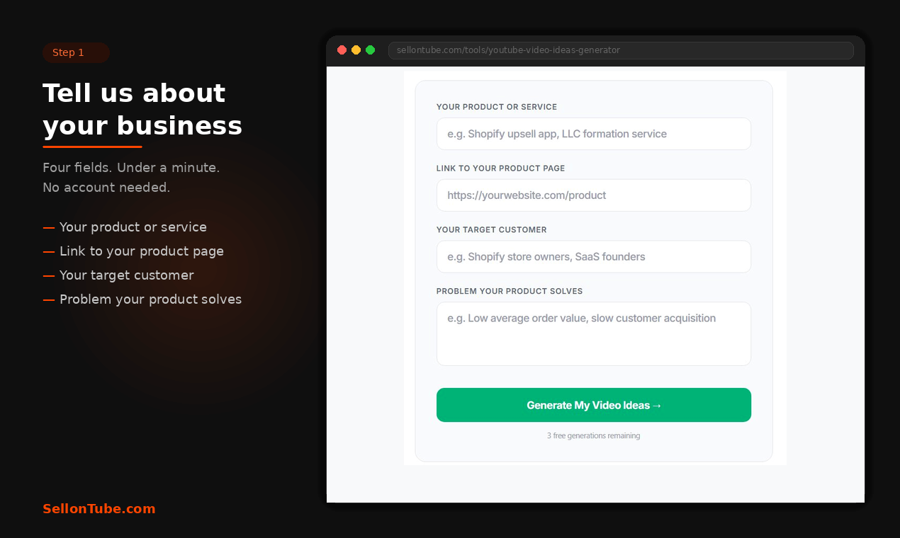

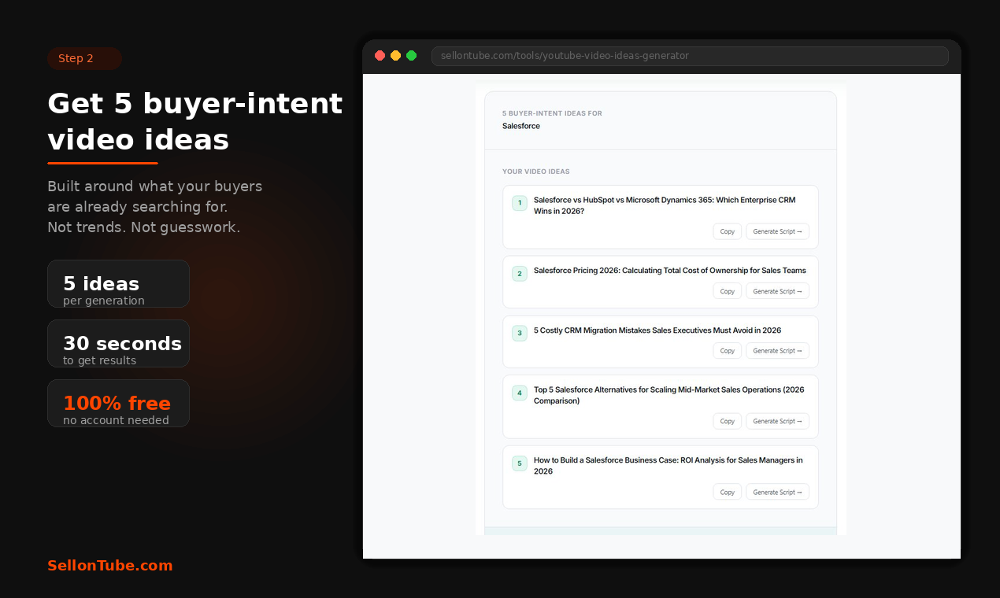

**SellonTube pros:**

- Built specifically for business channels, not creator channels
- Ideas mapped to buyer intent and business outcomes, not trending topics

**SellonTube cons:**

- Newer tool, smaller brand recognition than vidIQ or TubeBuddy
- Best results come when you give it specific business context, not just a broad niche

SellonTube's YouTube video ideas generator does one thing differently from every other tool on this list: it generates ideas mapped to business outcomes. Not trending topics calibrated for watch time. The ideas are designed around what potential customers search before they make a buying decision. It was built for Shopify store owners, B2B companies, SaaS founders, business coaches, service businesses, and international founders growing through YouTube.

Every other generator on this list asks for your niche. SellonTube asks for your business model. The output reflects that difference. The ideas come from the SellonTube team's real experience running YouTube content strategy for business clients. Not scraped trend data. Patterns from actual client results, specifically what attracts the right viewers, earns trust, and converts them into customers.

You describe your business, your audience, and what you sell. The tool returns video ideas built around purchase intent for that specific context. Try it at [sellontube.com/tools/youtube-video-ideas-generator](https://sellontube.com/tools/youtube-video-ideas-generator).

**SellonTube price:** Free.

---

## 2. [vidIQ](https://vidiq.com/ai-video-ideas-generator/)

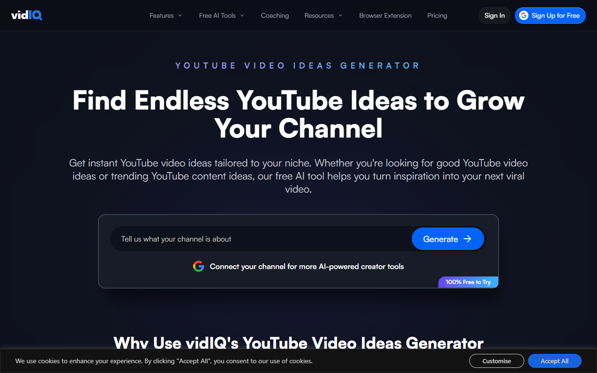

**vidIQ pros:**

- Data-driven suggestions that improve the more you use it
- Connected to a full YouTube optimisation suite including Title Generator, Script Writer, and Content Generator

**vidIQ cons:**

- Needs existing channel history to personalise well, making it less useful for businesses starting a channel from zero
- Ideas are calibrated for performance metrics, not specifically for business buyer intent

vidIQ's AI analyses trending topics, keywords, and audience behaviour to suggest video ideas. Connect it to your YouTube channel and it learns your content style over time, refining suggestions with each use. The system is trained on data from millions of videos, so the recommendations get sharper as it collects more data about what works for your specific channel.

For businesses with an established channel and at least a few months of upload history, vidIQ is one of the stronger options. It sits inside a larger suite that covers titles, scripts, and content generation, so the idea is just the starting point of a longer workflow. That integration matters when you are producing videos consistently.

Where it falls short for business channels is intent. vidIQ optimises for performance. Views, click-through rate, watch time. Those matter, but a business channel also needs ideas that attract people who are close to a buying decision. vidIQ does not distinguish between a video that gets 50,000 views from casual browsers and one that gets 2,000 views from ready-to-buy prospects. Once you have your idea, our [YouTube Title Generator](/tools/youtube-title-generator) can score titles for buyer intent before you publish.

**vidIQ price:** Free to try. Paid plans available.

---

## 3. [1of10](https://1of10.com/idea-generator/)

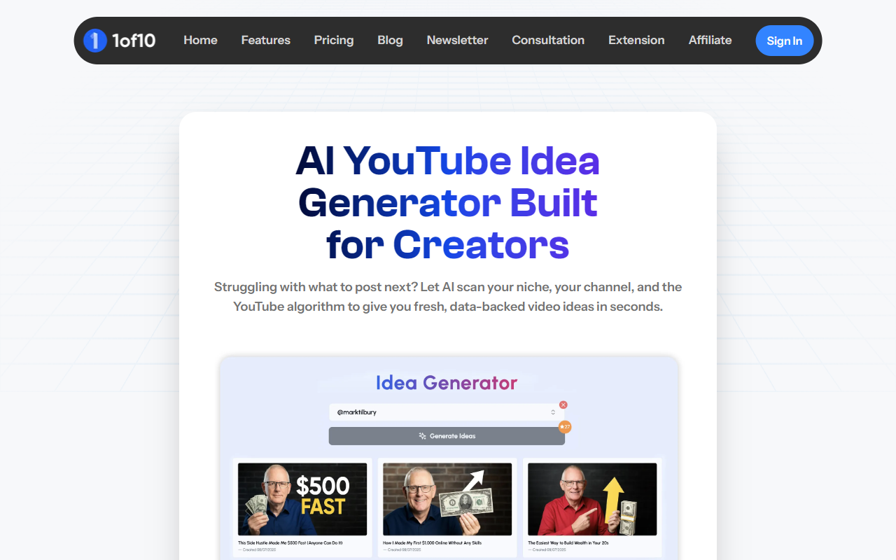

**1of10 pros:**

- Finds untapped angles using real performance data before you commit to a topic
- Strong for businesses who want to study what is working in their niche first

**1of10 cons:**

- More analytical than generative, requiring more time investment than prompt-based tools
- The idea generator is one feature inside a broader research platform

1of10 takes a research-first approach. Its outlier detection identifies videos performing significantly above a channel's average views. The platform looks at your channel, your niche, and current trends to surface ideas backed by real data. Trusted by over 10,000 YouTubers, its feature set includes a Niche Explorer, Competitor Tracker, Bookmarks, and Shorts Outliers alongside the Idea Generator.

The real value for business channels is in the research layer. You can hover over any video in the Competitor Tracker and instantly generate new ideas inspired by it. One documented result: a creator identified an 18M-view video that was 6x the channel's average, used the insight to produce a video that reached 2.6M views, a 185.7x outlier for their own channel. That kind of pattern recognition is hard to replicate with a simple prompt box.

The trade-off is time. 1of10 rewards patience. You need to spend time in the Competitor Tracker and Niche Explorer before the Idea Generator becomes genuinely useful. For businesses willing to invest that research time upfront, the ideas that come out tend to be more grounded than what you get from tools that only ask for a keyword.

**1of10 price:** Verify before publishing.

---

## 4. [TubeMagic](https://tubemagic.com/features/video-ideas)

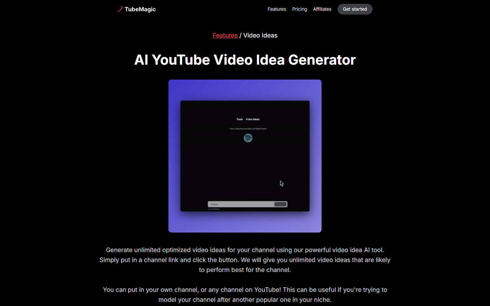

**TubeMagic pros:**

- Standout for competitive research: paste any YouTube channel URL and generate ideas based on that channel's content patterns
- Businesses can model content strategy after a top channel in their niche or track what competitors are making

**TubeMagic cons:**

- The channel-link feature is behind a paid plan
- Lighter on SEO data compared to dedicated analytics tools

TubeMagic's standout feature is simple and effective. Paste any YouTube channel URL, yours or a competitor's, and it generates ideas based on that channel's content patterns. For a business owner who has identified two or three competitors with strong YouTube presence, this turns their entire content library into a research source.

It also does keyword-based idea generation, so you are not locked into the channel analysis approach. All generated ideas are saved in your account logs for later reference. That logging feature is easy to overlook, but it matters when you are building a content calendar over weeks rather than grabbing one idea at a time.

The limitation is that the channel-link feature, which is TubeMagic's strongest selling point for business use, requires a paid plan. The free tier gives you keyword-based generation, which is functional but not meaningfully different from several free tools lower on this list.

**TubeMagic price:** Freemium. Verify exact plan pricing before publishing.

---

## 5. [Embarque](https://www.embarque.io/ai-tools/free-ai-youtube-video-idea-generator)

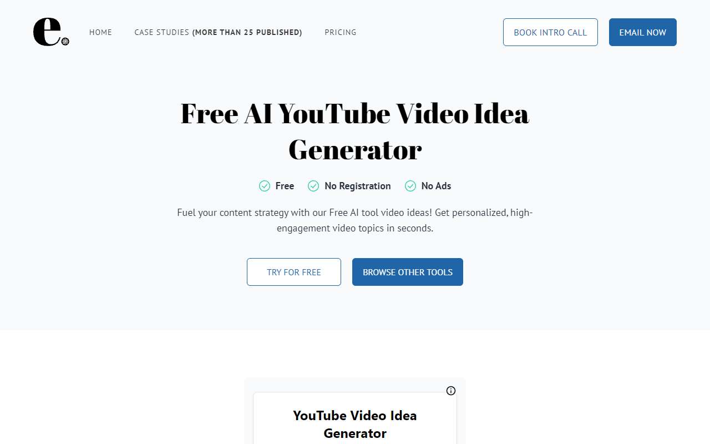

**Embarque pros:**

- SEO-informed idea generation with genuinely flexible inputs: niche, content type, target audience, keywords, and preferred video length
- Completely free with no account required

**Embarque cons:**

- A free lead-generation tool for Embarque's SEO agency, with limited depth versus dedicated YouTube platforms

Embarque is built by an SEO agency, and that shows in the output. The ideas tend to lean toward search intent rather than pure virality, which is closer to what a business channel needs. Inputs include your niche, content type, target audience, relevant keywords, and preferred video length. You can choose to generate between 1 and 10 ideas per run.

No registration, no ads, no account wall. That alone puts it ahead of several tools that gate basic functionality behind a signup. For a business owner who wants 10 quick ideas aligned with search behaviour and does not want to create yet another account, Embarque is a clean option.

The depth is limited. This is a free tool designed to attract potential clients to Embarque's SEO services. It does what it does well, but it is not a YouTube-specific platform with channel data, analytics, or content planning features.

**Embarque price:** Free. No account required.

---

## 6. [RyRob / RightBlogger](https://www.ryrob.com/youtube-video-idea-generator/)

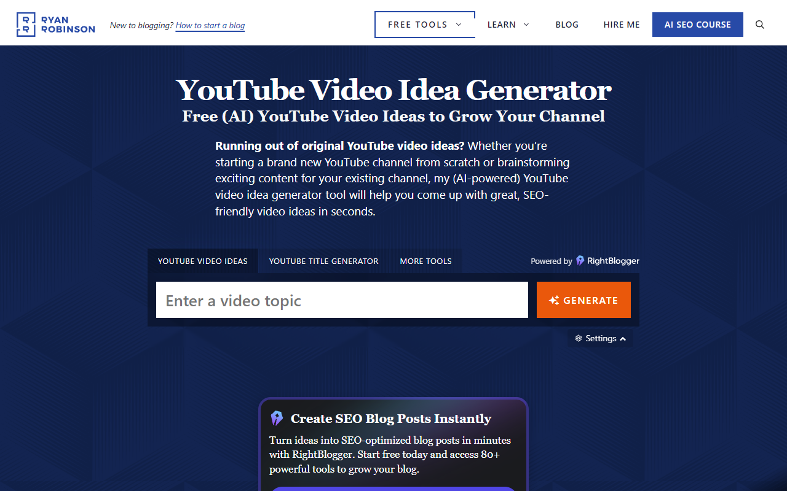

**RyRob / RightBlogger pros:**

- Strong tone customisation with 20+ options: Formal, Casual, Professional, Authoritative, Humorous, Storytelling, and more
- Genuinely unlimited free runs with no account required

**RyRob / RightBlogger cons:**

- Built primarily for bloggers, so business-specific YouTube ideation requires careful prompting to get relevant output

Powered by the RightBlogger platform built by Ryan Robinson, this generator stands out for tone control. Twenty-plus style options let you match the ideas to your brand voice before you even start scripting. A financial services firm and a streetwear brand need different kinds of YouTube content ideas. Most generators ignore that. This one gives you a dial.

Each run produces 10 ideas, and the free version allows unlimited runs with an hourly rate limit. No login required. The paid RightBlogger plan adds 30+ languages and saves generated ideas to your account, which helps if you are building a backlog.

The tool was designed for bloggers first. YouTube idea generation is one of many content tools in the RightBlogger suite. The output works best when you prompt it carefully with business-specific language rather than broad niche terms. A prompt like "B2B SaaS onboarding walkthrough" returns better results than just "software."

**RyRob / RightBlogger price:** Free with hourly rate limit. RightBlogger paid plans available.

---

## 7. [UTubeKit](https://utubekit.com/tools/video-ideas-generator)

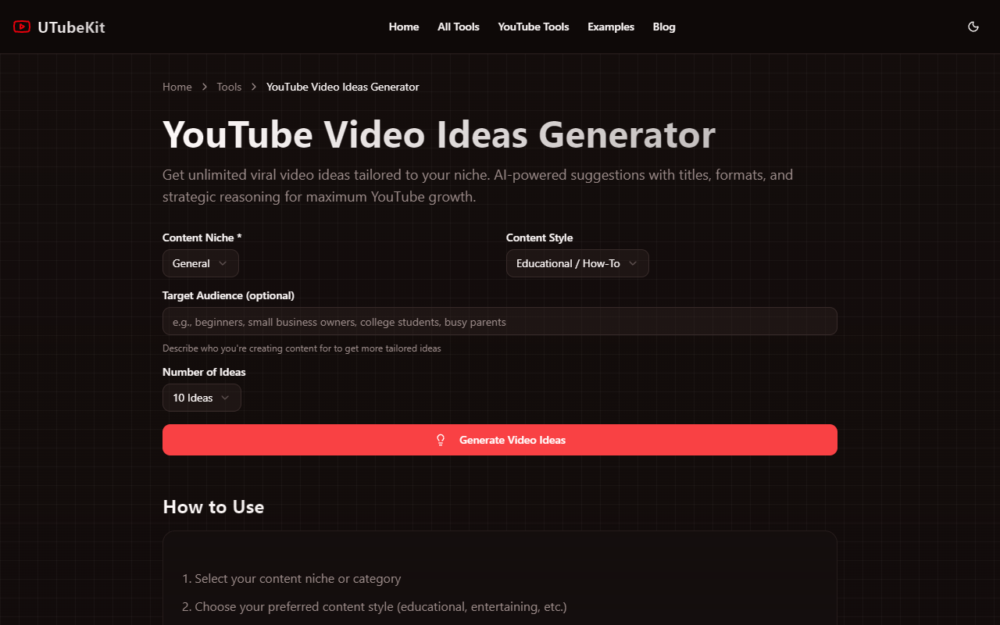

**UTubeKit pros:**

- Each idea includes a suggested title, difficulty level, and strategic reasoning explaining why it could perform
- Zero friction: no signup, completely free

**UTubeKit cons:**

- Newer tool with a smaller dataset than established platforms like vidIQ

UTubeKit does something most free generators skip. Each idea comes with context: a suggested title, a difficulty level, and a short explanation of why the topic might work. That reasoning layer turns a bare list of ideas into something you can actually evaluate before committing time to production.

Inputs are straightforward. Content niche, content style (educational, entertaining, and other options), an optional target audience description, and the number of ideas you want. Part of a broader suite that includes a Title Generator, Keyword Generator, and Video Script Writer.

For a business owner who wants more than a list of titles but does not need a full analytics platform, UTubeKit fills a gap. The strategic reasoning alone makes it more useful than tools that hand you 10 titles with no explanation of what makes them worth filming.

**UTubeKit price:** Free. No account required.

---

## 8. [SpeakNotes](https://speaknotes.io/free-tools/youtube-ideas-generator)

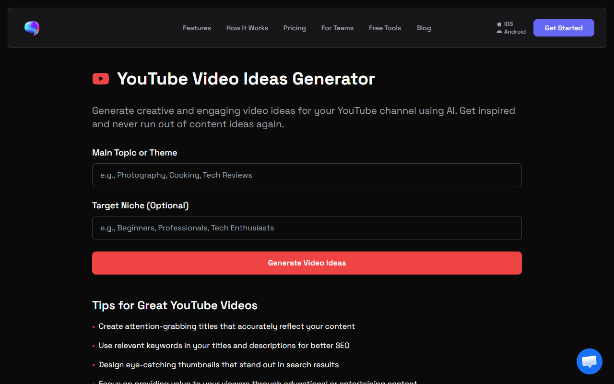

**SpeakNotes pros:**

- Zero friction: the fastest tool on this list to get a starting point
- No account required

**SpeakNotes cons:**

- Bare-bones with no customisation options
- A side tool, not central to SpeakNotes' core product of AI audio transcription and meeting notes

SpeakNotes is the tool you use when you need a list of ideas in under 30 seconds and you do not want to think about settings. Enter your main topic or theme, add an optional target niche, and hit generate. That is the entire interface.

The output is basic. No scoring, no reasoning, no keyword data. But sometimes you just need a prompt to break through a blank page, and SpeakNotes does that with less friction than anything else on this list.

It is part of SpeakNotes' free tools collection. Their core product is AI audio transcription and meeting notes. The YouTube idea generator is a side feature, which means it is unlikely to receive the same development attention as tools from companies whose entire business is YouTube.

**SpeakNotes price:** Free.

---

## 9. [Toolsaday](https://toolsaday.com/writing/youtube-video-ideas-generator)

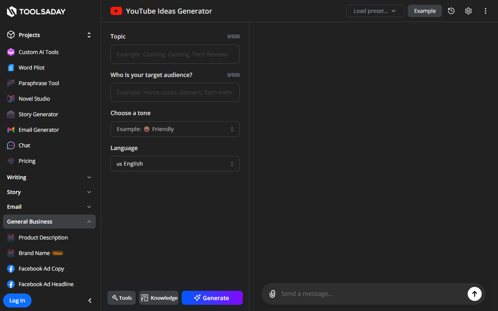

**Toolsaday pros:**

- Integrates into a broader AI writing workflow covering story ideas, ad copy, blog tools, and more
- Simple inputs with no learning curve

**Toolsaday cons:**

- YouTube ideation is one of dozens of tools in the suite, with no channel integration, no analytics, and no YouTube-specific data

Toolsaday uses NLP to analyse trending topics and predict viewer response to different content types. Inputs are limited to your channel topic and target audience. The simplicity is both the appeal and the limitation.

If you already use Toolsaday's writing suite for blog content, ad copy, or meta descriptions, adding YouTube ideation to the same workflow makes sense. Everything lives in one place. But the YouTube-specific depth is shallow compared to tools built exclusively for video content.

For a business owner juggling multiple content formats, the convenience of generating blog ideas, YouTube ideas, and ad copy from one platform has real value. For someone focused specifically on building a YouTube channel, the lack of video-specific data is a meaningful gap.

**Toolsaday price:** Free. Verify before publishing.

---

## 10. [LenosTube](https://www.lenostube.com/en/youtube-video-idea-generator/)

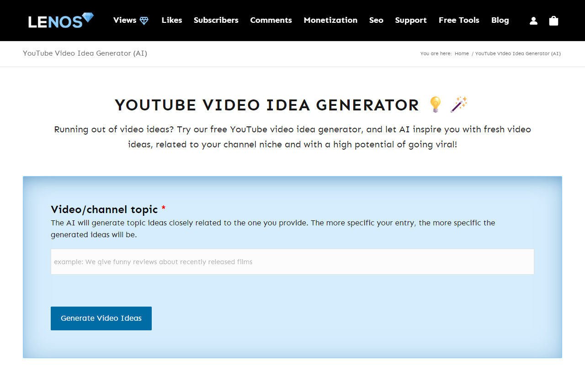

**LenosTube pros:**

- Fast and completely free with no account required
- Produces ideas in seconds with a one-click copy button

**LenosTube cons:**

- Only 5 ideas per generation with no customisation
- LenosTube's primary business is YouTube views and engagement services, so this generator is not their core offering

Enter a topic or niche. Get 5 ideas framed around viral potential. Copy them with one click. That is the full workflow.

LenosTube is fast and completely frictionless. No login, no settings, no configuration. If you need a handful of quick prompts and nothing more, it works.

The ideas are oriented toward virality rather than business outcomes. LenosTube's primary business is YouTube views and engagement services, so the generator exists as a free acquisition tool. Five ideas with no customisation is enough to spark a thought, but not enough to plan a content calendar.

**LenosTube price:** Free.

---

## 11. [Renderforest](https://www.renderforest.com/youtube-video-ideas)

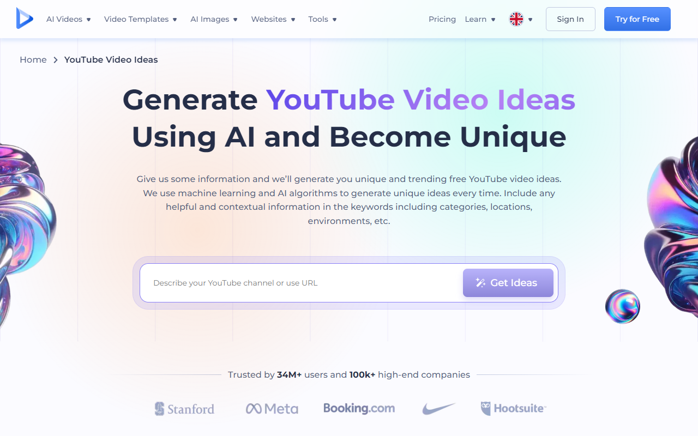

**Renderforest pros:**

- Fast and simple keyword-based generation
- Connects to Renderforest's broader video production and design tools if you want to build the video in the same place

**Renderforest cons:**

- Ideas trend generic without very specific keyword inputs

Renderforest's ML-based generator takes topic keywords and returns 10 ideas. The output quality depends heavily on how specific your keywords are. According to examples on their site, a travel creator entered "Bali, travel, beach" and received ideas including "A Lifestyle Traveler's Guide to Indonesia's Beaches." A beauty creator used "lifestyle, beauty, tips, shopping" and produced two videos from the output.

The connection to Renderforest's production suite is the real differentiator. If you already use Renderforest for video creation or design, generating ideas in the same ecosystem removes a step. For businesses already paying for Renderforest, the idea generator is a useful addition rather than a standalone reason to sign up.

Generic keywords produce generic ideas. The more specific you get with your input, including business type, audience, and product category in your keywords, the better the output.

**Renderforest price:** Free. Verify before publishing.

---

## 12. [VEED.io](https://www.veed.io/tools/script-generator/video-idea-generator)

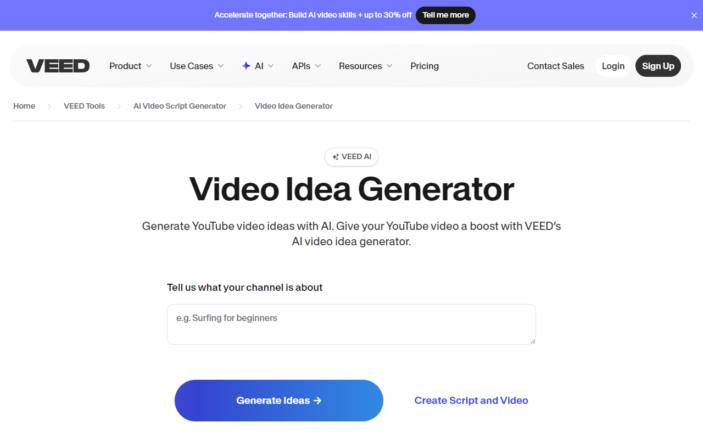

**VEED.io pros:**

- Goes from idea to production without leaving the platform, with a full video editor, caption generator, and production suite
- Covers multiple platforms in one pass: YouTube, TikTok, Instagram, LinkedIn

**VEED.io cons:**

- Idea generation is a small feature inside a large production platform, not built for deep content strategy or business-specific ideation

VEED.io treats idea generation as the first step of production, not a standalone activity. Select a platform (YouTube, TikTok, Instagram, or LinkedIn), choose a vibe or mood (casual, funny, informational, professional), and generate ideas that feed directly into VEED's video editor. Teams at Facebook, Visa, P&G, Pinterest, Booking.com, and Hublot use the platform.

For businesses that publish across multiple platforms, generating ideas for YouTube, LinkedIn, and Instagram in one session cuts planning time. The vibe selector adds a layer of brand control that most generators lack.

The trade-off is depth. VEED.io is a production platform first. The idea generator exists to feed the editor, not to replace a content strategy tool. If you need ideas shaped by keyword research, buyer intent, or competitive analysis, pair VEED with one of the tools higher on this list.

**VEED.io price:** Free plan available. Lite at $24/month removes watermark and increases export quality.

---

## 13. [TubeBuddy Video Topic Planner](https://www.tubebuddy.com/tools/video-topic-planner)

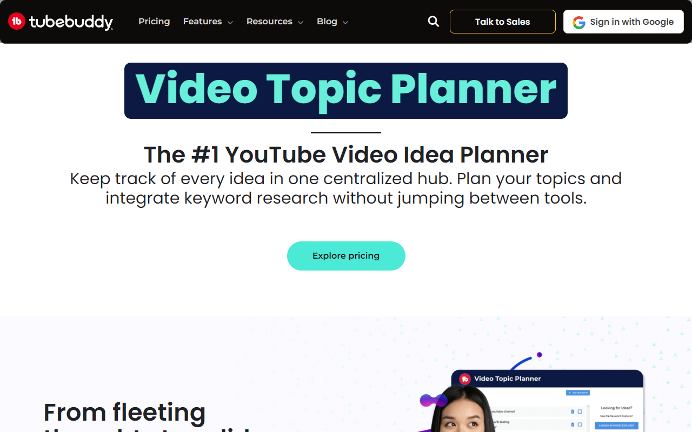

**TubeBuddy pros:**

- Idea generation backed by real keyword research and search volume data via Keyword Explorer
- Organises ideas into a full content calendar workflow with research notes and content queues

**TubeBuddy cons:**

- You are buying a suite, not a standalone generator. Idea planning is one part of a much larger optimisation platform.
- Requires connecting your YouTube channel

TubeBuddy's Video Topic Planner is a content planning tool that lets you capture, organise, and develop YouTube video ideas in one place. It uses TubeBuddy's Keyword Explorer to identify high-interest topics based on current trends and search volume. You can save keyword-rich topics, attach research notes, and organise ideas into a content queue. The browser extension integrates directly into YouTube Studio. Trusted by over 15 million creators, TubeBuddy reports that active users see 79% more views and 32% more subscribers than non-active users.

For businesses already committed to YouTube and looking for a YouTube video ideas generator that connects ideation to keyword data and scheduling, TubeBuddy is a strong fit. The content queue feature turns scattered ideas into an actual production plan.

The downside is that you are paying for an entire optimisation suite. If all you need is a quick list of ideas, TubeBuddy is overbuilt. But if you are running a YouTube channel as a serious business asset with weekly uploads, the planning infrastructure earns its cost.

**TubeBuddy price:** Freemium. Paid plans available. Verify current plan pricing before publishing.

---

## 14. [Instapage](https://instapage.com/en/ai-tools/ai-youtube-video-ideas-generator)

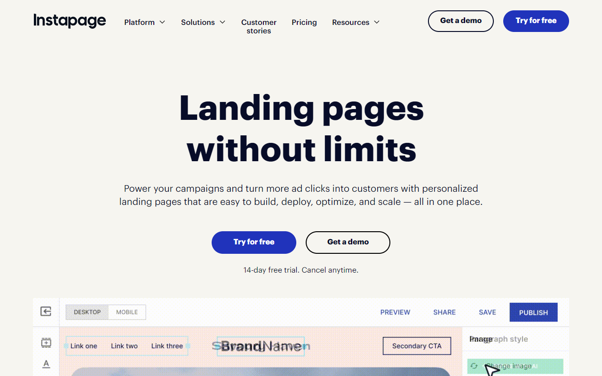

**Instapage pros:**

- Free standalone tool with no account friction
- Part of a marketing-oriented platform, which lends some business focus to the output

**Instapage cons:**

- Instapage's core product is landing page software, so this generator is a peripheral free tool with limited depth
- Less YouTube-specific than dedicated tools on this list

Instapage is a landing page platform. Their YouTube video ideas generator is one of several free AI marketing tools they offer to attract potential customers. The tool itself is a simple input-based generator with no channel integration or analytics.

The marketing orientation of Instapage's platform means the ideas lean slightly more business-friendly than tools built for entertainment creators. That is a minor advantage, but it is there.

For businesses already using Instapage for landing pages, having an idea generator inside the same ecosystem is convenient. For everyone else, the tools higher on this list offer more depth and YouTube-specific intelligence.

**Instapage price:** Free. Verify before publishing.

---

## Which YouTube video ideas generator is right for your business?

Start with what your business actually needs from YouTube. Then pick the tool that matches.

Pick by use case

<ul style="margin: 0; padding-left: 1.25rem;">
<li style="margin-bottom: 0.6rem; color: #334155; font-size: 0.9rem;"><strong>You want ideas tied to buyer intent and revenue, not views</strong> — SellonTube. Built specifically for this.</li>
<li style="margin-bottom: 0.6rem; color: #334155; font-size: 0.9rem;"><strong>You have an established channel and want data-backed SEO ideation</strong> — vidIQ or TubeBuddy. Both plug into your existing analytics.</li>
<li style="margin-bottom: 0.6rem; color: #334155; font-size: 0.9rem;"><strong>You want to research what is already performing before committing to a topic</strong> — 1of10. Its outlier detection shows you what is breaking through.</li>
<li style="margin-bottom: 0.6rem; color: #334155; font-size: 0.9rem;"><strong>You want to reverse-engineer a competitor's content strategy</strong> — TubeMagic. Channel URL in, content patterns out.</li>
<li style="margin-bottom: 0.6rem; color: #334155; font-size: 0.9rem;"><strong>You just need free, zero-friction ideas to get started</strong> — UTubeKit, RyRob, or SpeakNotes. Any of the three gets you moving in under a minute.</li>
<li style="margin-bottom: 0; color: #334155; font-size: 0.9rem;"><strong>You want to go from idea straight into video production</strong> — VEED.io handles the full workflow end-to-end.</li>
</ul>

Built for businesses, not creators

Get 5 buyer-intent video ideas for your product

Free. No account needed. Results in 30 seconds.

<a href="/tools/youtube-video-ideas-generator" style="display: inline-block; background: #10b981; color: #fff; font-weight: 700; padding: 0.75rem 1.75rem; border-radius: 8px; text-decoration: none; font-size: 0.95rem;">Try the video ideas generator</a>

---

## Related reading

- [How to identify YouTube topics that attract ready-to-buy customers](https://sellontube.com/blog/high-intent-topic-research-framework)
- [Why high-intent YouTube videos behave like SEO assets (for SaaS, agencies, and service businesses)](https://sellontube.com/blog/search-intent-youtube-seo-power)
- [YouTube vs. blog content: real conversion data from a Shopify app](https://sellontube.com/blog/youtube-vs-blog-shopify-app-case-study)
- [Build a YouTube marketing strategy that drives leads, not just views](/blog/youtube-marketing-strategy)
- [Step-by-step: create a YouTube channel for your business](/blog/create-youtube-channel-for-business)

---

## FAQ

### What is the best YouTube video idea generator for small businesses?

SellonTube's YouTube Video Ideas Generator is built specifically for business channels. It maps ideas to buyer intent rather than trending topics, making it the strongest option for small businesses that need YouTube content to drive enquiries and sales rather than just views. It is free to use and requires no account.

### How do I come up with YouTube video ideas for my business?

Start with what your customers search before they buy. Use a YouTube video ideas generator that accepts business context, not just a niche keyword. Describe your product, your audience, and the problem you solve. Tools like SellonTube, vidIQ, and TubeBuddy can turn that context into specific, filmable topics.

### Are YouTube video idea generators free to use?

Most are free or offer a free tier. SellonTube, Embarque, UTubeKit, SpeakNotes, RyRob, LenosTube, and Renderforest are all free with no account required. vidIQ, TubeBuddy, and TubeMagic offer free tiers with paid plans that unlock advanced features like channel analytics and keyword research data.
