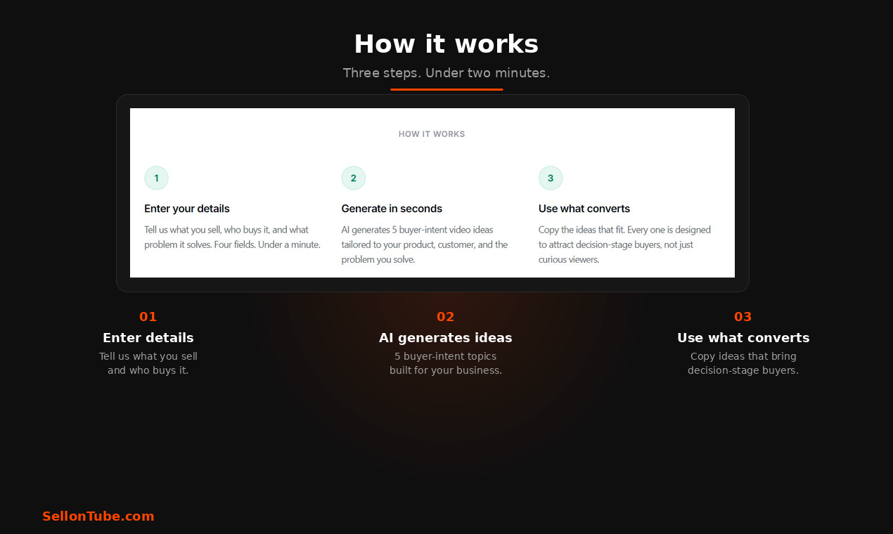

Most businesses fail on YouTube for a simple reason: they make videos nobody is searching for.

A YouTube content strategy for business channels starts with one question. What are your buyers already searching for? Not what’s trending. Not what your competitors post. What your actual customers type into YouTube before they buy.

Great production quality means nothing if the topic misses the mark. You could publish a stunning 4K video every week, but if no one searches for that subject, the views stay at zero. The fix is not more creativity. The fix is a research-backed content strategy that connects buyer questions to video topics, then stacks those videos into a library that compounds over time.

This guide walks you through the exact process, step by step. By the end, you will have a repeatable system for choosing video topics that rank in search, attract real buyers, and drive revenue.

Key Takeaways

<ul style="margin: 0; padding-left: 1.25rem;">
<li style="margin-bottom: 0.5rem; color: #334155; font-size: 0.9rem;">Start with the questions your buyers type into YouTube, not with video ideas you think are interesting.</li>
<li style="margin-bottom: 0.5rem; color: #334155; font-size: 0.9rem;">A low-volume keyword with strong buying intent outperforms a high-volume keyword with zero commercial relevance.</li>
<li style="margin-bottom: 0.5rem; color: #334155; font-size: 0.9rem;">Score every topic on search volume, buyer intent, and revenue alignment before producing anything.</li>
<li style="margin-bottom: 0.5rem; color: #334155; font-size: 0.9rem;">Four videos per month is the minimum cadence for compounding to work.</li>
<li style="margin-bottom: 0.5rem; color: #334155; font-size: 0.9rem;">Match each validated topic to the right video format: comparison, walkthrough, or framework.</li>
</ul>

## Contents

- [Step 1: Start with your buyer, not a video idea](#step-1-start-with-your-buyer-not-a-video-idea)
- [Step 2: Map keyword demand and buyer intent](#step-2-map-keyword-demand-and-buyer-intent)
- [Step 3: Reverse-engineer competitors to find content gaps](#step-3-reverse-engineer-competitors-to-find-content-gaps)
- [Step 4: Test whether the topic works as a video](#step-4-test-whether-the-topic-works-as-a-video)
- [Step 5: Score each topic by revenue potential](#step-5-score-each-topic-by-revenue-potential)
- [Step 6: Match each topic to a video format that converts](#step-6-match-each-topic-to-a-video-format-that-converts)
- [What happens when your content strategy compounds](#what-happens-when-your-content-strategy-compounds)

## Step 1: Start with your buyer, not a video idea

The first question should never be "what video should I make?" Instead, ask: "what problems push my buyers into research mode?"

Think about the moments right before someone purchases. They are comparing options. They are troubleshooting a pain point. They are evaluating whether a solution like yours is worth the money. Those moments produce specific search queries, and each query is a potential video topic.

Here is a concrete example. Say you sell a CRM for marketing agencies at $200 per month ($2,400 LTV). Your buyers ask questions like these before they purchase:

- "Best CRM for small marketing agency"
- "How to track client projects in one tool"
- "Agency CRM vs spreadsheet comparison"
- "CRM onboarding for a 15-person team"
- "How to stop losing client details between tools"

Each of those is a real search query. Each one maps directly to a video topic. Notice how none of them are generic ("what is a CRM?"). They are specific to a business type and a buying stage.

Your job is to build a list of 20 to 30 buyer questions. Talk to your sales team. Read support tickets. Check the exact language in customer reviews. Pull questions from Reddit threads and forum posts in your niche. These are the raw materials for your YouTube content strategy.

## Step 2: Map keyword demand and buyer intent

Once you have a list of buyer questions, validate them with data. The goal is to confirm that real people search for these topics on YouTube and Google.

Most keyword tools hand you a "search volume" number and stop there. That number alone is misleading. A keyword with 50,000 monthly searches but zero buying intent will never produce a customer. A keyword with 500 searches per month from people actively comparing solutions will convert 20x better.

Consider this comparison for the agency CRM example:

| Keyword | Monthly volume | Buyer intent |
|---|---|---|
| CRM software | 50,000 | Low. Mostly students, researchers, people browsing. |
| Best CRM for 15-person agency | 500 | Very high. This person is ready to buy. |
| How to migrate from spreadsheets to CRM | 800 | High. They have decided to switch and need guidance. |
| CRM features | 12,000 | Low. Informational, no purchase signal. |

The second and third keywords are where your content strategy should focus. Validate demand by typing each query into YouTube search and checking autocomplete suggestions. If YouTube auto-completes the phrase, people are searching for it. Then cross-reference with Google Trends to confirm the topic has stable or growing interest.

Score every keyword on two dimensions: search demand (are enough people searching?) and commercial intent (could the searcher realistically become a customer?). Drop anything that scores low on both.

## Step 3: Reverse-engineer competitors to find content gaps

Most industries already have YouTube content. But here is the good news: most of it is not built for customer acquisition.

Search YouTube for each of your validated keywords. Watch the top 5 results. Take notes on what they cover and, more importantly, what they miss.

For the agency CRM example, a search for "best CRM for small agency" might reveal:

- All 5 results are generic "top 10 CRM" listicles with no focus on agency workflows.
- None of them show the actual setup process for a 15-person team.
- Two videos are 45 minutes long with no timestamps, making them hard to watch.
- Zero videos compare CRMs specifically for agencies that manage client retainers.

Each gap is an opportunity. You can create a video that specifically answers the agency buyer’s question while the competition stays generic.

Use the [YouTube SEO Tool](/tools/youtube-seo-tool) to diagnose where a competitor’s video metadata misses the mark. Weak titles, missing keywords in descriptions, and absent tags all signal that you can outrank existing content with a tighter, more targeted video.

A single competitor’s weak video can reveal an entire cluster of rankable topics.

## Step 4: Test whether the topic works as a video

Not every valid keyword makes a good video. Some topics are better served by a blog post, a comparison table, or a simple FAQ page. Before committing production time, test whether the topic passes two filters.

**Filter 1: Can you demonstrate this on screen?** If the answer involves showing a dashboard, walking through a setup flow, or comparing two interfaces side by side, it works as a video. Screen recordings add value that text cannot replicate. A walkthrough of CRM pipeline setup for agency clients is inherently visual. A definition of "what does CRM stand for" is not.

**Filter 2: Does the topic reveal a deeper problem your product solves?** Good acquisition videos do two things at once. They solve the viewer’s immediate question, and they expose a bigger problem that leads naturally to your product.

For example: "How to stop losing client details between tools" solves an immediate frustration. But the real answer is that the viewer needs a centralized system, which is exactly what your CRM provides. The video educates without pitching, and the viewer connects the dots.

If a topic fails both filters, move it to your blog content calendar instead. The keyword still has value, just not as a video.

## Step 5: Score each topic by revenue potential

This is where most YouTube strategies fall apart. They pick topics based on search volume alone, then wonder why views do not translate to revenue.

Every topic that passes your filters needs a revenue score. Build a simple scoring table with five columns:

| Topic | Search vol | Buyer intent (1-5) | LTV alignment (1-5) | Video feasibility (1-5) | Total score |
|---|---|---|---|---|---|
| Best CRM for 15-person agency | 500 | 5 | 5 | 4 | 14 |
| Agency CRM vs spreadsheet | 800 | 4 | 5 | 5 | 14 |
| How to migrate to a CRM | 1,200 | 4 | 4 | 4 | 12 |
| CRM features explained | 12,000 | 1 | 2 | 3 | 6 |
| What is CRM software | 50,000 | 1 | 1 | 2 | 4 |

The scoring criteria:

- **Buyer intent (1-5):** How close is this searcher to a purchase decision? A "best X for Y" query scores 5. A "what is X" query scores 1.
- **LTV alignment (1-5):** Does this topic attract people who could realistically become paying customers at your price point? A topic that filters out low-value audiences scores higher.
- **Video feasibility (1-5):** Can you create a compelling, demonstrable video on this topic? Screen-heavy topics score higher than abstract concepts.

Rank your topics by total score. The top 12 become your first quarter of content. The [YouTube marketing ROI analysis](/blog/youtube-marketing-roi) covers how to calculate the full LTV math for six common business types.

Common Mistake

Do not chase high-volume keywords with low buyer intent. A video ranking #1 for "what is CRM software" will bring students, not buyers. Focus on the topics where search volume and purchase intent overlap.

## Step 6: Match each topic to a video format that converts

Once you have scored and ranked your topics, assign each one a video format. The format should match the search intent behind the query. Here is a practical mapping:

**Comparison queries → side-by-side demo.** When someone searches "agency CRM vs spreadsheet," they want to see both options next to each other. Record your screen showing the workflow in a spreadsheet, then show the same workflow in the CRM. Let the viewer see the difference, not just hear about it.

**How-to queries → screen walkthrough.** When someone searches "how to set up a CRM for my agency," they want step-by-step instructions they can follow along with. Record your screen, narrate each step, and keep the video under 8 minutes. Longer how-to videos lose viewers at the midpoint.

**Decision queries → framework video.** When someone searches "do I need a CRM for my agency," they need a decision framework, not a product pitch. Present 3 to 4 criteria they should evaluate. Walk through each one with specific examples. The viewer arrives at their own conclusion, which builds far more trust than a sales pitch.

**Mistake queries → before-and-after format.** When someone searches "agency client management mistakes," show the broken workflow first, then the fixed version. Visual contrast is more persuasive than a list of tips.

Keep every video between 3 and 8 minutes. Short enough to hold attention, long enough to cover the topic properly. Use voiceover with screen recordings or visuals rather than talking-head footage. This keeps the focus on the content, not the presenter.

For the full playbook on building your channel from the ground up, see the [YouTube marketing strategy guide](/blog/youtube-marketing-strategy). Starting from scratch? Here is [how to create a YouTube channel for your business](/blog/create-youtube-channel-for-business).

## What happens when your content strategy compounds

A single well-researched video might bring 50 views per month. That sounds small. But those 50 viewers searched for a specific buying-stage question, which means 5 to 10 of them are genuinely evaluating a solution like yours.

Now multiply. Publish 4 videos per month, each targeting a different buyer query. After 3 months you have 12 videos, each pulling in search traffic independently. After 6 months you have 24. After 12 months you have 48 search-intent entry points, all working around the clock without promotion.

This is how a YouTube content strategy compounds:

- **Month 1-3:** You build the foundation. First rankings appear. Traffic is modest.
- **Month 4-6:** The compounding effect becomes visible. Older videos gain authority. New videos rank faster because YouTube recognizes your channel’s topical expertise.
- **Month 7-12:** Each new video adds to a growing base. You stop needing to promote individual videos because search traffic handles distribution.

The key metric shifts from views to leads. A 48-video library targeting buyer-stage queries can produce a steady pipeline of qualified leads every single month, with zero ad spend.

That is the difference between a YouTube channel and a YouTube content strategy. One produces videos. The other produces customers.

What to Do This Week

<ol style="margin: 0; padding-left: 1.25rem;">
<li style="margin-bottom: 0.5rem; color: #14532d; font-size: 0.9rem;">Write down 20 questions your buyers ask before purchasing. Check sales calls, support tickets, and review sites.</li>
<li style="margin-bottom: 0.5rem; color: #14532d; font-size: 0.9rem;">Type each question into YouTube search. Note which ones autocomplete and which ones return weak results.</li>
<li style="margin-bottom: 0.5rem; color: #14532d; font-size: 0.9rem;">Score your top 12 topics using the revenue scoring table above. Rank by total score.</li>
<li style="margin-bottom: 0.5rem; color: #14532d; font-size: 0.9rem;">Assign a video format to your top 4 topics and schedule them for the next 30 days.</li>
</ol>

## Apply this framework in under a minute

The [SellonTube YouTube video ideas generator](/tools/youtube-video-ideas-generator) applies these buyer-intent filters to your specific product and customer. Describe what you sell, who buys it, and the problem you solve. It returns 5 ideas built around the decision-stage patterns above.

