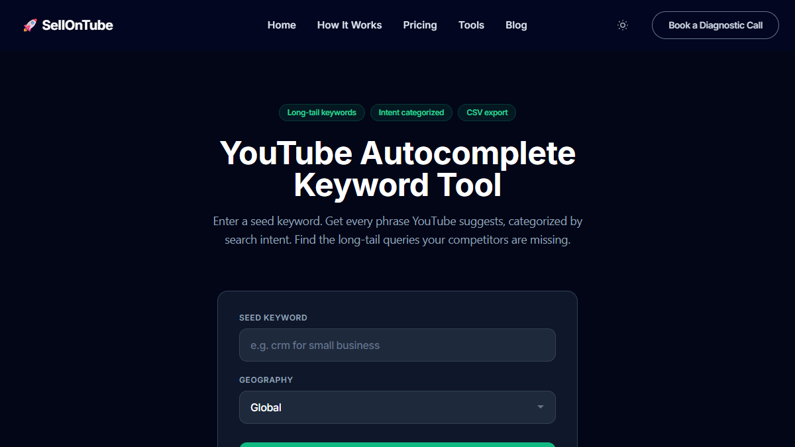

You have probably typed a keyword into YouTube's search bar and noticed the suggestions that appear. Nearly every marketer stops there. They grab a few phrases, pick one that sounds good, and move on.

That is not keyword research. That is guessing with extra steps.

Finding YouTube autocomplete keywords the right way means building a repeatable system. One that works across multiple seed keywords, multiple clients, and multiple content cycles. This post gives you that system.

Key Takeaways

<ul style="margin: 0; padding-left: 1.25rem;">
<li style="margin-bottom: 0.5rem; color: #334155; font-size: 0.9rem;">YouTube autocomplete keywords are the exact phrases real users type into the search bar. They reflect live search demand, not estimated volumes from third-party panels.</li>
<li style="margin-bottom: 0.5rem; color: #334155; font-size: 0.9rem;">The manual method works but does not scale. Ten seed keywords produce 80-100 suggestions with no way to prioritize them.</li>
<li style="margin-bottom: 0.5rem; color: #334155; font-size: 0.9rem;">An autocomplete tool scrapes all A-Z variations and intent modifiers in seconds. The best ones also tag each keyword by buyer intent.</li>
<li style="margin-bottom: 0.5rem; color: #334155; font-size: 0.9rem;">Raw keyword lists are not a strategy. You need a filter: topic relevance, search intent, and specificity determine which keywords are worth targeting.</li>
<li style="margin-bottom: 0; color: #334155; font-size: 0.9rem;">The workflow in this post works for solo operators and agencies. Run it weekly, not once.</li>
</ul>

## Contents

- [What Are YouTube Autocomplete Keywords?](#what-are-youtube-autocomplete-keywords)
- [How to Find YouTube Autocomplete Keywords Manually](#how-to-find-youtube-autocomplete-keywords-manually)
- [The Problem With Doing This Manually](#the-problem-with-doing-this-manually)
- [How to Use a Tool to Speed This Up](#how-to-use-a-tool-to-speed-this-up)
- [How to Decide Which Keywords Are Worth Targeting](#how-to-decide-which-keywords-are-worth-targeting)
- [A Simple Repeatable Workflow](#a-simple-repeatable-workflow)
- [Common Questions](#common-questions)

## What Are YouTube Autocomplete Keywords?

**YouTube autocomplete keywords** are the search suggestions YouTube displays as you type in the search bar. YouTube generates these predictions based on what other users have searched, weighted by recency, popularity, and your location.

They are not guesses. They are real queries that real people type, updated continuously.

To find YouTube autocomplete keywords, start with a broad seed keyword related to your product or service and type it into YouTube's search bar. YouTube will display 8-10 suggested completions. Expand the results by appending each letter of the alphabet ("keyword a," "keyword b," etc.) to capture long-tail variations. For faster results at scale, use an autocomplete scraping tool that runs all A-Z variations and buyer-intent modifiers automatically, then tags each suggestion by search intent (comparison, how-to, research) so you can prioritize keywords closest to a purchase decision. Export the results as a CSV and filter by intent priority before building your content calendar.

Unlike Google Keyword Planner data, which buckets volume into rough ranges and often overstates demand for niche terms, autocomplete reflects actual search behavior on YouTube specifically. A keyword with zero volume in GKP can still appear in YouTube autocomplete because people search for it on YouTube, not Google.

## How to Find YouTube Autocomplete Keywords Manually

Start with a seed keyword. This should be a broad term that describes your product, service, or topic. Keep it to one or two words. "CRM software," "email marketing," "project management." The broader the seed, the more varied the suggestions.

Open YouTube in an incognito or private browser window. This prevents your search history from influencing the results. Type your seed keyword into the search bar and stop typing.

YouTube will show 8-10 suggestions. Write them down.

Now add a space after your keyword, then type "a." A new set of suggestions appears. Write those down. Try "b," then "c," and continue through the alphabet.

Here is what this looks like with the seed keyword "crm software":

- **crm software** (base): crm software for small business, crm software free, crm software tutorial
- **crm software a**: crm software alternatives, crm software automation, crm software for agencies
- **crm software b**: crm software best, crm software for beginners, crm software benefits
- **crm software v**: crm software vs spreadsheet, crm software vs erp

Notice the patterns. Some suggestions start with your seed ("crm software for..."). Others end with it ("best crm software"). Some are questions ("what is the best crm software"). Each pattern reveals a different type of search intent.

Here is the thing. Those patterns are not random. They tell you exactly what stage of the buying journey the searcher is in. "Best CRM software for startups" is someone ready to buy. "What is a CRM" is someone still figuring out the category.

Write every suggestion in a spreadsheet. Add columns for the letter modifier you used and any notes about intent.

## The Problem With Doing This Manually

The manual method is accurate. Every suggestion comes straight from YouTube's API. But it does not scale.

| | Manual A-Z Method | Autocomplete Tool |
|---|---|---|
| **Time per seed keyword** | 15-20 minutes | Under 60 seconds |
| **Keywords returned** | 80-100 (if thorough) | 100-200+ (exhaustive mode) |
| **Intent tagging** | None. You sort manually. | Automatic. Five categories, priority-ranked. |
| **Export** | Copy-paste to spreadsheet | One-click CSV with metadata |
| **5 seed keywords** | 2-3 hours | 5 minutes |

Now multiply that by the 5-10 seed keywords a typical business or agency needs to cover. That is 2-3 hours of copy-paste work before you evaluate a single keyword.

And when you finish, you have a flat list. No way to tell which suggestions attract buyers and which attract browsers. "CRM software tutorial" and "best CRM software for startups" look similar in a spreadsheet. One drives views. The other drives pipeline. Without intent data, you cannot tell them apart.

**The bottleneck is not finding keywords. It is sorting the useful ones from the noise.**

**What most channels do:** Open YouTube, type a keyword, write down 8 suggestions. Repeat with A-Z modifiers. Spend 2 hours collecting 80 keywords in a spreadsheet with no way to prioritize them.

**What actually works:** Enter one seed keyword into an autocomplete tool. Get 100-200+ suggestions tagged by buyer intent in 60 seconds. Export the CSV. Sort by priority. Pick three High-intent keywords. Start filming.

But there is a catch.

Agencies face this at an even larger scale. Ten clients, each with 5 seed keywords, each needing quarterly refreshes. The manual method becomes a full-time job. Every hour spent on manual keyword collection is an hour not spent creating content that actually ranks.

## How to Use a Tool to Speed This Up

The [SellonTube YouTube Autocomplete Keyword Tool](https://sellontube.com/tools/youtube-autocomplete-keywords) automates the manual process and adds an intent layer on top.

Here is how to use it:

**Step 1:** Enter your seed keyword. The same one you would type into YouTube manually.

**Step 2:** Select your geography. If you sell to US customers, pick "United States." Global mode mixes results from every market, which dilutes relevance for localized campaigns. Twenty geography options are available.

**Step 3:** Choose your scrape mode. Quick scrape runs A-Z variations and returns 30-80 keywords in seconds. Exhaustive scrape adds 19 buyer-intent modifiers ("best," "vs," "alternatives to," "mistakes," "pricing") and returns 100-200+ unique keywords.

**Step 4:** Review the results. Every keyword is tagged with one of five intent categories: Comparison & Evaluation, Mistakes & Red Flags, Results & Proof, How-To & Problem-Solving, and Research & Discovery. Each carries a priority tag (High, Medium, or Low) based on proximity to a buying decision.

**Step 5:** Export the CSV. The file includes keyword, intent category, priority level, seed keyword, geography, and timestamp. Sort by priority. Your next video titles are at the top.

The entire process takes under 60 seconds. No signup. No email. No credit card.

> **Read more:** [10+ Best YouTube Autocomplete Keyword Tools (Free & Paid)](/blog/best-youtube-autocomplete-keyword-tools)

## How to Decide Which Keywords Are Worth Targeting

A list of 150 autocomplete keywords is not a content plan. The majority will not be worth your time. You need a filter.

**Topic relevance.** Can you actually make a video about this keyword? "CRM software pricing" is relevant if you sell CRM software or advise businesses on choosing one. "CRM software meme" is not. Drop anything that does not map to a video your audience would watch.

**Search intent.** Is the person searching this keyword close to a decision? Comparison keywords ("best CRM for startups," "HubSpot vs Salesforce") signal someone evaluating options. How-to keywords ("how to set up a CRM") signal someone learning. Research keywords ("what is a CRM") signal early-stage exploration.

All three have value. But the order you target them in matters. Comparison keywords generate leads this quarter. Research keywords build authority over time.

<svg viewBox="0 0 700 140" width="100%" style="max-width: 700px; margin: 1rem auto; display: block;" role="img" aria-label="Intent priority spectrum: Comparison and Evaluation at High, How-To at Medium, Research at Low">
  <rect x="0" y="0" width="700" height="140" rx="14" fill="#f8fafc" stroke="#e2e8f0" stroke-width="1.5"/>
  <text x="350" y="24" text-anchor="middle" fill="#94a3b8" font-family="Inter,system-ui,sans-serif" font-size="10" font-weight="700" letter-spacing="0.1em">INTENT PRIORITY SPECTRUM</text>
  <rect x="16" y="40" width="216" height="42" rx="8" fill="#ecfdf5" stroke="#10b981" stroke-width="1.5"/>
  <text x="124" y="58" text-anchor="middle" fill="#064e3b" font-family="Inter,system-ui,sans-serif" font-size="12" font-weight="700">Comparison &amp; Evaluation</text>
  <text x="124" y="73" text-anchor="middle" fill="#065f46" font-family="Inter,system-ui,sans-serif" font-size="10">best, vs, review, pricing</text>
  <rect x="16" y="88" width="216" height="20" rx="4" fill="#dc2626"/>
  <text x="124" y="102" text-anchor="middle" fill="#fff" font-family="Inter,system-ui,sans-serif" font-size="9" font-weight="700">HIGH: Leads this quarter</text>
  <rect x="242" y="40" width="216" height="42" rx="8" fill="#eff6ff" stroke="#3b82f6" stroke-width="1.5"/>
  <text x="350" y="58" text-anchor="middle" fill="#1e3a5f" font-family="Inter,system-ui,sans-serif" font-size="12" font-weight="700">How-To &amp; Problem-Solving</text>
  <text x="350" y="73" text-anchor="middle" fill="#1e40af" font-family="Inter,system-ui,sans-serif" font-size="10">how to, tutorial, setup</text>
  <rect x="242" y="88" width="216" height="20" rx="4" fill="#2563eb"/>
  <text x="350" y="102" text-anchor="middle" fill="#fff" font-family="Inter,system-ui,sans-serif" font-size="9" font-weight="700">MEDIUM: Builds trust</text>
  <rect x="468" y="40" width="216" height="42" rx="8" fill="#f8fafc" stroke="#94a3b8" stroke-width="1.5"/>
  <text x="576" y="58" text-anchor="middle" fill="#334155" font-family="Inter,system-ui,sans-serif" font-size="12" font-weight="700">Research &amp; Discovery</text>
  <text x="576" y="73" text-anchor="middle" fill="#64748b" font-family="Inter,system-ui,sans-serif" font-size="10">what is, why, should I</text>
  <rect x="468" y="88" width="216" height="20" rx="4" fill="#94a3b8"/>
  <text x="576" y="102" text-anchor="middle" fill="#fff" font-family="Inter,system-ui,sans-serif" font-size="9" font-weight="700">LOW: Authority over time</text>
</svg>

**Specificity.** "CRM" is too broad. You will never rank for it. "Best CRM software for real estate agents" is specific enough to win. Look for keywords with 4-8 words. These long-tail phrases have lower competition and attract more qualified viewers.

Here is a quick example. Your seed keyword is "email marketing software." The autocomplete tool returns three keywords. Each gets a different decision.

| Autocomplete keyword | Intent | Priority | Decision |
|---|---|---|---|
| best email marketing software for Shopify | Comparison | High | Target this. Specific, buyer-intent, relevant. |
| email marketing software tutorial | How-To | Medium | Add to backlog. Relevant but lower intent. |
| email marketing software free | Research | Low | Skip. Broad competition, low intent. |

Three keywords, three different decisions. That filter saves you from filming the wrong video.

> **Read more:** [YouTube SEO Guide: The Complete Framework](/blog/youtube-seo-guide)

## A Simple Repeatable Workflow

Here is the system. Run it weekly or monthly, depending on your publishing cadence.

<svg viewBox="0 0 800 110" width="100%" style="max-width: 800px; margin: 1.5rem auto; display: block;" role="img" aria-label="Six-step YouTube autocomplete keyword workflow: Seeds, Scrape, Sort, Filter, Pick, Save">
  <defs>
    <marker id="arwG" markerWidth="8" markerHeight="6" refX="8" refY="3" orient="auto">
      <path d="M0,0 L8,3 L0,6" fill="#10b981"/>
    </marker>
  </defs>
  <rect x="0" y="0" width="800" height="110" rx="14" fill="#f8fafc" stroke="#e2e8f0" stroke-width="1.5"/>
  <rect x="12" y="16" width="108" height="78" rx="10" fill="#ecfdf5" stroke="#10b981" stroke-width="1.5"/>
  <text x="66" y="48" text-anchor="middle" fill="#064e3b" font-family="Inter,system-ui,sans-serif" font-size="11" font-weight="700">1. Pick seeds</text>
  <text x="66" y="64" text-anchor="middle" fill="#065f46" font-family="Inter,system-ui,sans-serif" font-size="9">3-5 keywords</text>
  <line x1="124" y1="55" x2="142" y2="55" stroke="#10b981" stroke-width="2" marker-end="url(#arwG)"/>
  <rect x="146" y="16" width="108" height="78" rx="10" fill="#ecfdf5" stroke="#10b981" stroke-width="1.5"/>
  <text x="200" y="48" text-anchor="middle" fill="#064e3b" font-family="Inter,system-ui,sans-serif" font-size="11" font-weight="700">2. Scrape</text>
  <text x="200" y="64" text-anchor="middle" fill="#065f46" font-family="Inter,system-ui,sans-serif" font-size="9">Exhaustive mode</text>
  <line x1="258" y1="55" x2="276" y2="55" stroke="#10b981" stroke-width="2" marker-end="url(#arwG)"/>
  <rect x="280" y="16" width="108" height="78" rx="10" fill="#ecfdf5" stroke="#10b981" stroke-width="1.5"/>
  <text x="334" y="48" text-anchor="middle" fill="#064e3b" font-family="Inter,system-ui,sans-serif" font-size="11" font-weight="700">3. Sort</text>
  <text x="334" y="64" text-anchor="middle" fill="#065f46" font-family="Inter,system-ui,sans-serif" font-size="9">By intent priority</text>
  <line x1="392" y1="55" x2="410" y2="55" stroke="#10b981" stroke-width="2" marker-end="url(#arwG)"/>
  <rect x="414" y="16" width="108" height="78" rx="10" fill="#ecfdf5" stroke="#10b981" stroke-width="1.5"/>
  <text x="468" y="48" text-anchor="middle" fill="#064e3b" font-family="Inter,system-ui,sans-serif" font-size="11" font-weight="700">4. Filter</text>
  <text x="468" y="64" text-anchor="middle" fill="#065f46" font-family="Inter,system-ui,sans-serif" font-size="9">Relevance + specificity</text>
  <line x1="526" y1="55" x2="544" y2="55" stroke="#10b981" stroke-width="2" marker-end="url(#arwG)"/>
  <rect x="548" y="16" width="108" height="78" rx="10" fill="#ecfdf5" stroke="#10b981" stroke-width="1.5"/>
  <text x="602" y="48" text-anchor="middle" fill="#064e3b" font-family="Inter,system-ui,sans-serif" font-size="11" font-weight="700">5. Pick 3-5</text>
  <text x="602" y="64" text-anchor="middle" fill="#065f46" font-family="Inter,system-ui,sans-serif" font-size="9">Video titles</text>
  <line x1="660" y1="55" x2="678" y2="55" stroke="#10b981" stroke-width="2" marker-end="url(#arwG)"/>
  <rect x="682" y="16" width="108" height="78" rx="10" fill="#ecfdf5" stroke="#10b981" stroke-width="1.5"/>
  <text x="736" y="48" text-anchor="middle" fill="#064e3b" font-family="Inter,system-ui,sans-serif" font-size="11" font-weight="700">6. Backlog</text>
  <text x="736" y="64" text-anchor="middle" fill="#065f46" font-family="Inter,system-ui,sans-serif" font-size="9">Save the rest</text>
</svg>

1. **Pick 3-5 seed keywords** that describe your product, service, or core topics. Keep each to one or two words.

2. **Run each seed through the [SellonTube autocomplete tool](https://sellontube.com/tools/youtube-autocomplete-keywords).** Use the exhaustive scrape with your target geography selected. Export the CSV for each seed.

3. **Sort each CSV by intent priority.** Pull all High-priority keywords into a separate list. These are your video title candidates.

4. **Filter for relevance and specificity.** Drop keywords you cannot make a video about. Drop anything too broad to rank for. You should have 5-15 actionable keywords per seed.

5. **Pick 3-5 keywords for this content cycle.** Each one becomes a video. Run the winning keywords through the [YouTube Title Generator](/tools/youtube-title-generator) to test title variations. Check existing videos with the [YouTube SEO Tool](/tools/youtube-seo-tool) to make sure your metadata matches. If you need topic validation before committing to a keyword, run it through the [Video Ideas Evaluator](/tools/youtube-video-ideas-evaluator).

6. **Save the rest.** The remaining keywords go into a backlog spreadsheet with their intent tags. Next month, start at step 3 with the same CSVs, or re-run the scrape if your seeds have changed.

This workflow takes 15-20 minutes per cycle. It produces a prioritized, intent-tagged keyword list you can hand to a team member, share with a client, or use yourself. If you want to understand how this fits into a broader YouTube strategy, read the [YouTube SEO Guide](/blog/youtube-seo-guide) and [YouTube Marketing ROI](/blog/youtube-marketing-roi) breakdown.

So what does this actually mean for your business?

**Every week you skip this process, a competitor with less expertise is ranking for the exact long-tail queries your buyers type.** They do not have better products. They do not have deeper knowledge. They just showed up for the search terms you left on the table. Start with one seed keyword today: [SellonTube YouTube Autocomplete Keyword Tool](https://sellontube.com/tools/youtube-autocomplete-keywords). Free, no signup, results in under 60 seconds.

## Common Questions

### How does YouTube autocomplete work?

YouTube autocomplete predicts search queries based on what other users have typed. As you enter characters in the search bar, YouTube surfaces the most popular completions in real time. These suggestions reflect actual search demand, not advertiser data. They update continuously based on trending searches, seasonal patterns, and regional differences.

### What is the best keyword strategy for YouTube?

Start with autocomplete keywords that match your product or service. Filter for buyer intent by prioritizing comparison, review, and "best" queries over general how-to or definition queries. Target 3-5 high-intent keywords per month and build one video around each. Pair autocomplete discovery with a [YouTube SEO tool](/tools/youtube-seo-tool) to confirm your titles and descriptions match the phrases buyers search.

### Can you do YouTube keyword research for free?

Yes. The YouTube search bar itself is a free keyword research tool. Type a seed keyword and note every suggestion. For faster results, [SellonTube's autocomplete tool](https://sellontube.com/tools/youtube-autocomplete-keywords) scrapes all variations, tags them by intent, and exports a CSV. No signup required. For volume estimates, pair autocomplete data with a free tool like RyRob. For a full comparison of free and paid options, see the [best YouTube autocomplete keyword tools](/blog/best-youtube-autocomplete-keyword-tools) roundup.
